**DISEÑO Y CONSTRUCCIÓN DEL BACKEND TRANSACCIONAL Y DEL MÓDULO DE VISIÓN ARTIFICIAL PARA UN SISTEMA INTEGRAL DE GESTIÓN DE PARQUEADEROS BASADO EN IoT Y RECONOCIMIENTO AUTOMÁTICO DE PLACAS VEHICULARES (ALPR).**

**Pasante:**

**JESÚS BELEÑO**

**Cod. [CÓDIGO]**

**Director de Pasantías:**

**[DIRECTOR]**

**UNIVERSIDAD SURCOLOMBIANA**

**FACULTAD DE INGENIERÍA**

**INGENIERÍA DE SOFTWARE**

**2026**

---

[**CAPÍTULO I	3**](#capítulo-i)

[**1. Introducción	3**](#1-introducción)

[1.1. Planteamiento del problema	4](#11-planteamiento-del-problema)

[1.2. Justificación	5](#12-justificación)

[1.3. Preguntas de investigación	6](#13-preguntas-de-investigación)

[1.3.1. Pregunta general	6](#131-pregunta-general)

[1.3.2. Preguntas específicas	6](#132-preguntas-específicas)

[1.4. Objetivos general y específicos	7](#14-objetivos-general-y-específicos)

[1.4.1. Objetivo general	7](#141-objetivo-general)

[1.4.2. Objetivos específicos	7](#142-objetivos-específicos)

[**CAPÍTULO II	8**](#capítulo-ii)

[**2. METODOLOGÍA	8**](#2-metodología)

[2.1. Fase I: Análisis	8](#21-fase-i-análisis)

[2.2. Fase II: Diseño	11](#22-fase-ii-diseño)

[2.3. Fase III: Implementación	11](#23-fase-iii-implementación)

[2.3.1. Tecnologías a utilizar	12](#231-tecnologías-a-utilizar)

[2.4. Fase IV: Pruebas	14](#24-fase-iv-pruebas)

[2.5. Fase V: Despliegue y Mejora Continua	16](#25-fase-v-despliegue-y-mejora-continua)

[2.6. Herramientas a utilizar	16](#26-herramientas-a-utilizar)

[**CAPÍTULO III	17**](#capítulo-iii)

[**3. RESULTADOS	17**](#3-resultados)

[3.1. Aplicación de la Fase I: Análisis	17](#31-aplicación-de-la-fase-i-análisis)

[3.1.1. Lista de requerimientos funcionales	17](#311-lista-de-requerimientos-funcionales)

[3.1.2. Lista de requerimientos no funcionales	20](#312-lista-de-requerimientos-no-funcionales)

[3.1.3. Historias de usuario	22](#313-historias-de-usuario)

[3.1.4. Diagramas de Casos de uso	23](#314-diagramas-de-casos-de-uso)

[3.2. Aplicación de la Fase II: Diseño	24](#32-aplicación-de-la-fase-ii-diseño)

[3.2.1. Diagrama de arquitectura propuesta del sistema	24](#321-diagrama-de-arquitectura-propuesta-del-sistema)

[3.2.2. Diseño del modelo de datos y de la API	26](#322-diseño-del-modelo-de-datos-y-de-la-api)

[3.3. Aplicación de la Fase III: Implementación	28](#33-aplicación-de-la-fase-iii-implementación)

[3.3.1. Tecnologías utilizadas	28](#331-tecnologías-utilizadas)

[3.3.2. Estructura del proyecto	29](#332-estructura-del-proyecto)

[3.3.3. Módulo de autenticación y gestión de sesión	30](#333-módulo-de-autenticación-y-gestión-de-sesión)

[3.3.4. Modelo de datos y mecanismos de borrado lógico	32](#334-modelo-de-datos-y-mecanismos-de-borrado-lógico)

[3.3.5. Módulo de gestión multi-tenant de parqueaderos	34](#335-módulo-de-gestión-multi-tenant-de-parqueaderos)

[3.3.6. Sistema de tickets manuales y reservas	36](#336-sistema-de-tickets-manuales-y-reservas)

[3.3.7. Sistema de notificaciones en tiempo real (WebSocket STOMP)	38](#337-sistema-de-notificaciones-en-tiempo-real-websocket-stomp)

[3.3.8. Módulo de visión artificial: detector YOLOv11n y OCR PaddleOCR	40](#338-módulo-de-visión-artificial-detector-yolov11n-y-ocr-paddleocr)

[3.3.9. Flujo automático de tickets disparado por OCR	42](#339-flujo-automático-de-tickets-disparado-por-ocr)

[3.4. Aplicación de la Fase IV: Pruebas del sistema	44](#34-aplicación-de-la-fase-iv-pruebas-del-sistema)

[3.4.1. Prueba de autenticación con JWT y rotación de refresh token	44](#341-prueba-de-autenticación-con-jwt-y-rotación-de-refresh-token)

[3.4.2. Prueba de creación de ticket manual con bloqueo pesimista	45](#342-prueba-de-creación-de-ticket-manual-con-bloqueo-pesimista)

[3.4.3. Prueba de cierre de ticket y cálculo automático del monto	47](#343-prueba-de-cierre-de-ticket-y-cálculo-automático-del-monto)

[3.4.4. Prueba del flujo automático OCR — entrada nueva	48](#344-prueba-del-flujo-automático-ocr--entrada-nueva)

[3.4.5. Prueba del flujo automático OCR — salida confirmada físicamente	49](#345-prueba-del-flujo-automático-ocr--salida-confirmada-físicamente)

[3.4.6. Prueba de notificaciones WebSocket en tiempo real	50](#346-prueba-de-notificaciones-websocket-en-tiempo-real)

[3.4.7. Prueba de degradación silenciosa del sidecar OCR	52](#347-prueba-de-degradación-silenciosa-del-sidecar-ocr)

[3.4.8. Prueba end-to-end del sistema desplegado en producción	53](#348-prueba-end-to-end-del-sistema-desplegado-en-producción)

[3.5. Aplicación de la Fase V: Despliegue	55](#35-aplicación-de-la-fase-v-despliegue)

[3.5.1. Construcción de imágenes Docker multi-stage	55](#351-construcción-de-imágenes-docker-multi-stage)

[3.5.2. Versionamiento semántico y publicación	55](#352-versionamiento-semántico-y-publicación)

[3.5.3. Orquestación con Docker Compose y Dokploy	56](#353-orquestación-con-docker-compose-y-dokploy)

[3.5.4. URL pública y observabilidad	56](#354-url-pública-y-observabilidad)

[**4. Conclusiones y recomendaciones	57**](#4-conclusiones-y-recomendaciones)

[**Referencias	58**](#referencias)

[**Anexos	59**](#anexos)

[Anexo A. Requerimientos del sistema	59](#anexo-a-requerimientos-del-sistema)

[Anexo B. Historias de usuario	59](#anexo-b-historias-de-usuario)

[Anexo C. Diagramas de casos de uso	60](#anexo-c-diagramas-de-casos-de-uso)

[Anexo D. Diagramas del modelo de datos	60](#anexo-d-diagramas-del-modelo-de-datos)

[Anexo E. Repositorio del código fuente	61](#anexo-e-repositorio-del-código-fuente)

[Anexo F. Documentación de endpoints	61](#anexo-f-documentación-de-endpoints)

---

# **CAPÍTULO I**

# **1. Introducción**

En el marco del desarrollo de las ciudades inteligentes, la integración de tecnologías como el Internet de las Cosas (IoT), la visión artificial y los servicios distribuidos en la nube ha redefinido la forma en que se gestionan los servicios urbanos. Estas ciudades aprovechan la conectividad permanente, los sensores inteligentes, el análisis de datos y los modelos de aprendizaje profundo para transformar la administración de recursos y espacios públicos, entre los cuales los estacionamientos vehiculares constituyen un punto recurrente de congestión cotidiana.

La gestión operativa de un parqueadero no se limita al conteo de espacios disponibles. Comprende el registro de cada entrada y salida de vehículo, la asociación entre placa y conductor, el cálculo automático del cobro en función de tarifas, la coordinación con dispositivos físicos (barreras, sensores, cámaras), la prevención de fraudes (salidas sin pago, reasignaciones indebidas de cubículos), y la consulta y reserva de espacios desde aplicaciones móviles. Resolver de manera conjunta este conjunto de necesidades exige una arquitectura de software que aísle responsabilidades sin sacrificar la consistencia transaccional.

En respuesta a lo anterior, el presente proyecto propone el diseño, la construcción y el despliegue de un **backend transaccional** que actúa como columna vertebral del sistema integral de gestión de parqueaderos, complementado con un **módulo de visión artificial desplegado como sidecar HTTP** que automatiza el reconocimiento de placas vehiculares (Automatic License Plate Recognition, ALPR). El backend, construido sobre Spring Boot 3 y Java 21, expone una API REST de aproximadamente 138 endpoints, soporta autenticación basada en JSON Web Tokens (JWT) con rotación de refresh tokens, propaga eventos de dominio en tiempo cercano al real mediante WebSocket STOMP, y persiste la información sobre PostgreSQL 16 enriquecido con la extensión PostGIS para el manejo de geometrías. El sidecar OCR, construido sobre FastAPI y Python 3.11, integra un detector YOLOv11n entrenado a propósito sobre 4 201 imágenes anotadas de placas vehiculares y un reconocedor de caracteres basado en PaddleOCR con votación por mayoría y filtrado por expresión regular del formato colombiano `ABC123`.

Esta solución, enmarcada en los principios de las ciudades inteligentes, no solo automatiza tareas previamente operadas de manera manual, sino que aporta una **separación arquitectónica clara entre la lógica transaccional y la lógica de visión por computador**, demostrando empíricamente que es viable acoplar un modelo de aprendizaje profundo a un sistema empresarial mediante una interfaz HTTP delgada, sin comprometer la estabilidad del backend ni renunciar al ecosistema de visión por computador propio del lenguaje Python.

# 

## **1.1. Planteamiento del problema**

La gestión ineficiente de los parqueaderos urbanos constituye un desafío recurrente en las ciudades en crecimiento. El problema que aborda el presente proyecto no se reduce a la visualización de espacios disponibles, sino que comprende dos dimensiones interrelacionadas: una **dimensión operativa** y una **dimensión arquitectónica**.

Desde la dimensión operativa, los parqueaderos actuales dependen casi por completo de procesos manuales para el registro de entradas y salidas, la asociación de placas con tickets, el cálculo de tarifas y la conciliación de pagos. Estos procesos manuales son lentos, propensos al error humano, sujetos a fraude (placas registradas que nunca entraron, salidas sin pago) y difíciles de auditar. Adicionalmente, los operadores carecen de mecanismos automáticos para descubrir incidentes como la *salida fantasma* (un vehículo abandona el parqueadero sin que se haya registrado el cierre de ticket) o el *cobro sin salida física* (el operador cierra el ticket en el sistema pero el vehículo continúa dentro del recinto). Estas inconsistencias degradan la confiabilidad del sistema y la experiencia del usuario final.

Desde la dimensión arquitectónica, integrar un módulo de visión artificial dentro de un sistema empresarial transaccional implica resolver problemas no triviales. El procesamiento de imágenes —detección de regiones de interés, reconocimiento óptico de caracteres— se realiza naturalmente en el ecosistema Python (Ultralytics, OpenCV, PaddleOCR, TensorFlow). Por su parte, la gestión transaccional, la concurrencia controlada, la propagación de eventos y el cumplimiento de invariantes de negocio se realizan idiomáticamente en el ecosistema de la JVM (Spring Boot, Hibernate, Spring Security). Embeber el modelo de visión en la JVM (por ejemplo, mediante Deep Java Library) sacrifica el ecosistema maduro de Python; embeber Python directamente en el proceso del backend introduce riesgos de inestabilidad, gestión compleja de dependencias nativas y bloqueos del *Global Interpreter Lock* que comprometen la escalabilidad de la API REST.

La principal dificultad radica, por lo tanto, en cómo construir una arquitectura que permita la captura, procesamiento y transmisión de datos desde los sensores y cámaras instaladas en los parqueaderos hacia una capa transaccional confiable, garantizando al mismo tiempo: (a) consistencia fuerte de los datos de tickets y pagos, (b) latencia baja para la notificación de cambios al cliente, (c) tolerancia a fallos del módulo de visión (degradación silenciosa cuando el OCR no responde), (d) prevención de condiciones de carrera bajo concurrencia (dos vehículos compitiendo por el mismo cubículo), y (e) auditabilidad completa de cada flujo automático.

En ese sentido, el problema central que aborda este proyecto se formula de la siguiente manera:

¿Cómo diseñar y construir un sistema backend transaccional para la gestión integral de parqueaderos, integrando IoT y reconocimiento automático de placas vehiculares mediante visión artificial, de manera que se garantice la consistencia, la concurrencia controlada, la actualización en tiempo cercano al real y la tolerancia a fallos del módulo de visión, en el marco de una ciudad inteligente?

# 

## **1.2. Justificación**

La presente propuesta se justifica desde tres perspectivas complementarias: la operativa, la arquitectónica y la técnico-científica.

Desde la perspectiva **operativa**, el sistema responde a una necesidad concreta de los administradores de parqueaderos urbanos: eliminar la dependencia del operador humano para el registro rutinario de placas, reducir el tiempo de procesamiento de cada vehículo en los puntos de entrada y salida, y prevenir incidentes de fraude o pérdida de tickets. La automatización del registro mediante ALPR reduce el número de interacciones manuales necesarias para operar un parqueadero, lo que disminuye los costos operativos del administrador y el tiempo de atención al usuario final. La incorporación de notificaciones en tiempo cercano al real mediante WebSocket habilita la consulta anticipada de disponibilidad por parte de los conductores, lo cual contribuye al ordenamiento del tráfico urbano.

Desde la perspectiva **arquitectónica**, el proyecto propone una solución basada en microservicios débilmente acoplados con un patrón *sidecar HTTP*, donde el backend principal en Spring Boot se comunica con el módulo de visión por computador en Python a través de una interfaz REST interna a la red Docker. Este diseño aporta cuatro propiedades: (a) mantiene cada componente en su ecosistema idiomático (JVM para la lógica transaccional, Python para la visión por computador), (b) habilita el escalado independiente de cada componente, (c) ofrece **degradación silenciosa** ante fallos del módulo de visión (si el sidecar no responde, el flujo principal de la API continúa funcionando), y (d) habilita la actualización del módulo de OCR a una versión posterior sin recompilar ni redesplegar el backend.

Desde la perspectiva **técnico-científica**, el proyecto aporta un **benchmark experimental** de soluciones de reconocimiento óptico de caracteres aplicadas al caso particular de placas vehiculares colombianas, que compara empíricamente cinco soluciones externas (EasyOCR, Tesseract, PaddleOCR, TrOCR, docTR) y dos arquitecturas entrenadas localmente (ResNet50 y EfficientNet-B0) sobre un conjunto de 60 imágenes derivadas de 12 placas reales con cinco variaciones controladas de iluminación y ruido. Este benchmark prioriza la métrica de **consistencia** sobre la métrica de precisión literal, elección que se justifica empíricamente por el caso de uso del parqueadero: si la misma placa produce la misma cadena en la entrada y la salida —aun cuando esa cadena no sea literalmente la verdadera—, el sistema puede asociar al vehículo en la base de datos. El benchmark identifica una solución ganadora basada en PaddleOCR enriquecido con votación por mayoría y filtrado regex, que alcanza el 100 % de consistencia (12/12 placas) en el conjunto de prueba.

En consecuencia, este proyecto no solo responde a una necesidad concreta dentro de los entornos urbanos, sino que también aporta evidencia experimental aplicable a otros proyectos de visión por computador en contextos transaccionales, alineándose con los principios de innovación, eficiencia y sostenibilidad propios de las ciudades inteligentes.

## **1.3. Preguntas de investigación**

### **1.3.1. Pregunta general**

* ¿Cómo diseñar y construir un sistema backend transaccional para la gestión integral de parqueaderos, integrando IoT y reconocimiento automático de placas vehiculares mediante visión artificial, de manera que se garantice la consistencia, la concurrencia controlada, la actualización en tiempo cercano al real y la tolerancia a fallos del módulo de visión, en el marco de una ciudad inteligente?

### **1.3.2. Preguntas específicas**

* ¿Cómo identificar y definir los requisitos funcionales y no funcionales del sistema, con el fin de diseñar un modelo de datos relacional jerárquico y una API REST que integren multi-tenancy, geometrías PostGIS y borrado lógico?
* ¿Cómo implementar una arquitectura de microservicios con un sidecar HTTP de visión artificial, garantizando degradación silenciosa, prevención de condiciones de carrera y propagación de eventos en tiempo cercano al real?
* ¿Cómo construir y entrenar un detector de placas vehiculares basado en YOLOv11n, y cómo seleccionar empíricamente la solución de OCR con mayor consistencia para el formato colombiano `ABC123`?
* ¿Cómo validar la precisión, confiabilidad y robustez del sistema completo mediante pruebas unitarias, pruebas de integración y un benchmark experimental de las soluciones de OCR consideradas?
* ¿Cómo desplegar el sistema en un entorno real garantizando su disponibilidad, rendimiento, escalabilidad y observabilidad, y cómo asegurar su mejora continua mediante optimización del rendimiento y corrección de errores?

## **1.4. Objetivos general y específicos**

### **1.4.1. Objetivo general**

* Diseñar e implementar un sistema integral para la gestión operativa de parqueaderos vehiculares, que combine un backend de servicios REST con persistencia transaccional y eventos en tiempo cercano al real, junto con un módulo de visión por computador que automatice el registro de entradas y salidas mediante la detección y reconocimiento automático de placas vehiculares (ALPR) en cámaras de vigilancia.

### **1.4.2. Objetivos específicos**

* Diseñar un modelo de datos relacional jerárquico (Empresa → Parqueadero → Nivel → Sección → SubSección → Punto de parqueo) que soporte multi-tenant, geometrías PostGIS y borrado lógico (soft-delete).
* Implementar una API REST con autenticación JWT (access + refresh con rotación), control de acceso basado en roles (USER, ADMIN, SUPER_ADMIN) y aislamiento por empresa.
* Desarrollar un sistema de notificaciones en tiempo cercano al real basado en WebSocket STOMP para refrescar la disponibilidad y los eventos operativos en los clientes web y móviles.
* Construir y entrenar un detector de placas vehiculares basado en YOLOv11n, optimizado para condiciones reales del entorno colombiano (placas amarillas y blancas, formato `ABC123`).
* Comparar cinco soluciones de OCR para la lectura de los caracteres de la placa (EasyOCR, Tesseract, PaddleOCR, TrOCR, docTR) y dos arquitecturas entrenadas localmente (ResNet50, EfficientNet-B0), priorizando la consistencia de la lectura sobre la precisión literal.
* Integrar el módulo de visión como un sidecar HTTP interno al backend, con cooldown para evitar duplicados y degradación silenciosa ante fallos.
* Automatizar el flujo de entrada/salida de tickets a partir de la detección de placa, considerando casos especiales (vehículo invitado, ticket duplicado, salida fantasma, salida física confirmada).
* Validar el sistema completo de extremo a extremo en un entorno de despliegue real (Dokploy) con pruebas funcionales y de rendimiento.

# 

# **CAPÍTULO II**

# **2. METODOLOGÍA**

El desarrollo del presente proyecto se llevó a cabo mediante un enfoque metodológico basado en el ciclo de vida del software, el cual permite estructurar de manera organizada las etapas necesarias para la construcción de la solución propuesta. Este enfoque garantiza un desarrollo controlado y orientado al cumplimiento de los requisitos definidos, asegurando además la trazabilidad entre los requerimientos, las decisiones de diseño, la implementación y las pruebas.

El ciclo de vida del software aplicado en este proyecto contempla las siguientes fases:

## **2.1. Fase I: Análisis**

En esta fase se identifican y documentan las necesidades del sistema, tanto funcionales como no funcionales. Se realizó un levantamiento de información que permitió establecer las funcionalidades principales del backend transaccional —registro de usuarios, autenticación basada en JWT, gestión de empresas y parqueaderos, registro manual y automático de tickets, reservas de espacios, cálculo de tarifas, generación de facturas, gestión de cámaras IoT, y notificaciones en tiempo cercano al real— así como del módulo de visión artificial encargado del reconocimiento de placas.

Cada requerimiento se especificó utilizando una plantilla derivada del estándar IEEE 29148, que incluye:

* Identificador y nombre del requerimiento.
* Tipo y prioridad.
* Descripción detallada del comportamiento esperado.
* Entradas y salidas asociadas.
* Precondiciones y postcondiciones.
* Manejo de situaciones anormales.
* Criterios de aceptación.

Se utilizará la siguiente plantilla para la realización de los requerimientos funcionales:

**Tabla 1**
*Plantilla de requerimientos funcionales del sistema*

| Campo | Detalle |
| ----- | ----- |
| **Id** |  |
| **Nombre** |  |
| **Tipo** |  |
| **Prioridad** |  |
| **Descripción** |  |
| **Entrada** |  |
| **Salida** |  |
| **Precondición** |  |
| **Postcondición** |  |
| **Manejo de Situaciones Anormales** |  |
| **Criterios de Aceptación** |  |

*Fuente: Elaboración propia con base en el estándar IEEE 29148.*

Se utilizará la siguiente plantilla para la realización de los requerimientos no funcionales:

**Tabla 2**
*Plantilla de requerimientos no funcionales del sistema*

| Campo | Detalle |
| ----- | ----- |
| **Id** |  |
| **Nombre** |  |
| **Tipo** |  |
| **Prioridad** |  |
| **Descripción** |  |

*Fuente: Elaboración propia con base en el estándar IEEE 29148.*

Se utilizará la siguiente plantilla para la realización de historias de usuario:

**Tabla 3**
*Plantilla de historias de usuario*

| Campo | Detalle |
| :---- | :---- |
| **Requerimiento** |  |
| **Id** |  |
| **Título** |  |
| **Historia** |  |
| **Criterios de aceptación** |  |

*Fuente: Elaboración propia.*

Adicionalmente, durante esta fase se construyeron diagramas de casos de uso para cada requerimiento funcional, ilustrando las interacciones entre los actores del sistema (Usuario, Administrador, Vigilante, Sistema OCR, Sistema de Cámaras) y las funcionalidades expuestas por el backend.

## **2.2. Fase II: Diseño**

Durante esta fase se diseñó la arquitectura general del sistema, definiendo los componentes principales y la manera en que estos interactúan. Se adoptó una arquitectura **cliente-servidor de tres capas con un sidecar HTTP de visión por computador**, donde el cliente (aplicación móvil React Native y/o panel web) consume una API REST publicada por el backend Spring Boot, el cual delega el procesamiento de imágenes al sidecar Python sobre una red privada Docker. Esta separación permite mantener cada componente en su ecosistema idiomático sin acoplar tecnologías incompatibles dentro de un mismo proceso.

Como apoyo al proceso de diseño se elaboró un **diagrama de arquitectura propuesta** que ilustra las cuatro capas funcionales del sistema (capa de cliente, capa de servicios externos, capa de aplicación y capa de datos), así como un **diagrama entidad-relación** que modela las entidades principales del dominio (Empresa, Parqueadero, Nivel, Sección, SubSección, PuntoParqueo, Ticket, Reserva, Factura, Pago, Vehículo, Usuario, Dispositivo, Cámara). Se diseñó también el catálogo de eventos de dominio (`TicketCreadoEvent`, `TicketCerradoEvent`, `TicketPuntoCambiadoEvent`, `ReservaCreadaEvent`, `ReservaCanceladaEvent`, `CamaraImagenActualizadaEvent`, `PlacaDetectadaEvent`) que serán publicados por la capa de servicio y consumidos por listeners asíncronos responsables de la propagación vía WebSocket.

## **2.3. Fase III: Implementación**

Durante esta fase se desarrolló el backend del sistema, los servicios REST, la capa de persistencia, el sidecar de visión por computador y los flujos automáticos disparados por la detección de placas. La implementación se organizó de forma modular: el código del backend reside en el paquete raíz `com.usco.parqueaderos_api`, organizado en 14 sub-paquetes funcionales (auth, user, parking, ticket, reservation, tariff, billing, vehicle, device, catalog, location, notification, ocr y common). El sidecar reside en el directorio `ocr/` del repositorio y expone un endpoint HTTP `POST /read-plate` que recibe la imagen y devuelve las placas detectadas y reconocidas.

La comunicación entre el cliente y el backend se realiza mediante peticiones REST sobre HTTP/HTTPS, mientras que la actualización en tiempo cercano al real se efectúa por medio de WebSocket STOMP sobre SockJS. La comunicación entre el backend y el sidecar OCR se realiza mediante una petición HTTP `multipart/form-data` interna a la red Docker, sin exposición al exterior. La persistencia de la información se delega a PostgreSQL 16 enriquecido con la extensión PostGIS 3.4 para el almacenamiento de geometrías (`POINT`, `POLYGON`).

### **2.3.1. Tecnologías a utilizar**

**Tabla 4**
*Cuadro comparativo de las herramientas seleccionadas para el desarrollo del sistema*

| Herramienta | Alternativas comunes | Motivo de selección |
| ----- | ----- | ----- |
| **Spring Boot (Java 21)** | Quarkus, Micronaut, Django, Express | Se selecciona Spring Boot debido a su ecosistema maduro de seguridad (Spring Security), persistencia (Spring Data JPA), mensajería (Spring Messaging) y observabilidad (Spring Actuator), así como por la disponibilidad de soporte nativo para Java 21 con virtual threads. Esta combinación reduce el esfuerzo de integración entre módulos y permite aprovechar características modernas del lenguaje como `record` para los DTO. |
| **PostgreSQL 16 + PostGIS** | MySQL, MariaDB, MongoDB | Se selecciona PostgreSQL por su soporte de transacciones ACID completas, índices parciales y bloqueos de fila en modo `SELECT ... FOR UPDATE`, características indispensables para prevenir condiciones de carrera en la asignación de puntos de parqueo. PostGIS aporta la capacidad de almacenar geometrías y realizar consultas espaciales (`ST_Distance`, `ST_Contains`) necesarias para localizar parqueaderos cercanos. |
| **Hibernate / Spring Data JPA** | MyBatis, jOOQ, JDBC plano | Se selecciona Hibernate por su capacidad de mapear automáticamente entidades JPA a tablas relacionales y por su soporte de carga perezosa (`LAZY`) y bloqueos pesimistas declarativos (`@Lock(PESSIMISTIC_WRITE)`). Spring Data JPA aporta los repositorios derivados de interfaz, reduciendo el código repetitivo de acceso a datos. |
| **Spring Security + JJWT** | Keycloak, Auth0, Okta | Se selecciona Spring Security por su integración nativa con Spring Boot, y JJWT por su compatibilidad con Java 17+ y su mantenimiento activo. La combinación habilita autenticación stateless con rotación de refresh tokens sin requerir un servidor de identidad externo. |
| **Spring Messaging (STOMP/SockJS)** | Socket.IO, RabbitMQ, MQTT | Se selecciona STOMP sobre SockJS por su integración directa con Spring Messaging, su soporte de fallback a HTTP cuando los WebSockets no están disponibles, y su semántica de tópicos (`/topic/parqueadero/{id}`) y colas (`/queue/usuario/{id}`) compatible con suscripciones desde clientes JavaScript, móviles y de escritorio. |
| **Python 3.11 + FastAPI** | Flask, Django REST, Node.js + Express | Se selecciona FastAPI por su soporte nativo de asincronía (ASGI, no presente en Flask) y por su validación automática de parámetros mediante Pydantic. La combinación con Uvicorn proporciona un servidor HTTP de producción con una huella de memoria reducida. |
| **Ultralytics YOLOv11n** | Faster R-CNN, SSD, Detectron2 | Se selecciona YOLOv11n por su relación entre precisión y velocidad sobre CPU. La variante *nano* contiene 2.6 M parámetros y se ejecuta en el entorno de despliegue sin GPU, alcanzando un *mAP50* de 0.987 sobre el conjunto de validación. |
| **PaddleOCR** | Tesseract, EasyOCR, TrOCR, docTR | Se selecciona PaddleOCR como motor de reconocimiento óptico de caracteres después de un benchmark experimental sobre 60 imágenes derivadas de 12 placas reales con 5 variaciones de iluminación y ruido. Las alternativas se discuten en detalle en la sección 3.3.8. |
| **OpenCV (headless)** | Pillow, scikit-image | Se selecciona OpenCV por su soporte para transformaciones de brillo, contraste, filtros bilaterales, redimensionamiento y conversiones de color. La variante *headless* elimina las dependencias de interfaz gráfica que no se requieren en un servidor sin pantalla. |
| **Docker + Docker Compose** | systemd + binarios, Kubernetes, Nomad | Se seleccionan Docker y Docker Compose por la simplicidad que aportan al empaquetado de las dos imágenes (backend Java + sidecar Python) y por su compatibilidad con la plataforma PaaS auto-hospedada Dokploy, que actúa como orquestador de producción. |
| **Dokploy + GHCR** | Heroku, Render, Vercel, Kubernetes | Se selecciona Dokploy por ser una plataforma PaaS auto-hospedada de bajo costo, capaz de ejecutar contenedores Docker en un servidor t3.micro de AWS sin requerir un cluster de Kubernetes. GitHub Container Registry (GHCR) se selecciona como registro de imágenes por su integración directa con los repositorios y por su cuota gratuita generosa. |

*Fuente: Elaboración propia.*

## **2.4. Fase IV: Pruebas**

En esta etapa se diseñaron y ejecutaron pruebas enfocadas en la validación del backend, el módulo de visión artificial y el flujo automático completo. Las pruebas se organizaron en tres niveles:

En primer lugar, se aplicaron **pruebas unitarias** sobre los servicios críticos del backend, utilizando JUnit 5 + Mockito para aislar las dependencias y verificar los invariantes de negocio: cálculo de tarifas, asignación de puntos libres con bloqueo pesimista, ejecución del flujo automático de tickets según el tipo de cámara, cliente HTTP al sidecar OCR con manejo de timeouts, y resolución de pagos.

En segundo lugar, se aplicaron **pruebas de integración** que ejecutan el backend completo contra una base de datos PostgreSQL real (PostGIS), validando el correcto comportamiento de las consultas JPQL nativas, los índices parciales y los bloqueos de fila bajo concurrencia.

En tercer lugar, se aplicaron **pruebas end-to-end** sobre el sistema desplegado en el ambiente de producción (Dokploy), ejecutando escenarios reales que abarcan el flujo completo desde la subida de una imagen de cámara hasta la emisión del evento `PLACA_DETECTADA` por WebSocket. Estos escenarios cubren los siete posibles valores del campo `accion` del evento, incluyendo casos especiales como la entrada duplicada, la salida confirmada físicamente y la salida fantasma.

Adicionalmente, se realizó un **benchmark experimental** del módulo de OCR, comparando empíricamente cinco soluciones externas y dos arquitecturas propias sobre un conjunto de 60 imágenes derivadas de 12 placas reales con 5 variaciones controladas (original, brillo aumentado, oscurecido, recorte expandido y ruido gaussiano).

Se realizaron los siguientes casos de prueba:

* Prueba de autenticación con JWT y rotación de refresh token.
* Prueba de creación de ticket manual con bloqueo pesimista.
* Prueba de cierre de ticket y cálculo automático del monto.
* Prueba del flujo automático OCR — entrada nueva.
* Prueba del flujo automático OCR — salida confirmada físicamente.
* Prueba de notificaciones WebSocket en tiempo real.
* Prueba de degradación silenciosa del sidecar OCR.
* Prueba end-to-end del sistema desplegado en producción.

Estas pruebas permitieron verificar el comportamiento del sistema frente a escenarios normales y anómalos, validando la robustez del backend ante fallos parciales del módulo de visión.

## **2.5. Fase V: Despliegue y Mejora Continua**

En esta fase se realizó el despliegue del sistema en un entorno de producción real, utilizando la plataforma auto-hospedada **Dokploy** sobre un servidor de AWS EC2 (instancia t3.micro). Para ello, se construyeron dos imágenes Docker con un enfoque *multi-stage* (etapas separadas de compilación y de ejecución) que se publicaron en el registro de contenedores de GitHub (GHCR) bajo la organización `jbeleno`. Dokploy detecta los cambios en las imágenes publicadas y ejecuta automáticamente `docker compose pull && docker compose up -d` sobre los servicios afectados.

El despliegue incluyó la configuración del compose de producción —con variables de entorno gestionadas a través de Dokploy—, la creación de volúmenes persistentes para las imágenes de cámara, la definición de redes Docker privadas para la comunicación interna entre backend y sidecar, y la exposición controlada del backend al exterior en el puerto 5445.

Adicionalmente, la fase contempló actividades de **seguimiento y mejora continua** orientadas a la detección y corrección de errores, optimización del rendimiento (reducción de la latencia del flujo OCR de 8 s a 3-5 s mediante el pre-warming de los modelos durante la construcción de la imagen) y ajuste de funcionalidades identificadas durante las pruebas en producción.

## **2.6. Herramientas a utilizar**

Durante el desarrollo del proyecto se emplearon las siguientes herramientas:

* **IntelliJ IDEA Ultimate**: entorno de desarrollo integrado para el backend Java.
* **Visual Studio Code**: editor para el sidecar Python, los archivos de configuración y los scripts de despliegue.
* **Git + GitHub**: control de versiones y alojamiento del repositorio remoto.
* **Docker Desktop**: construcción y ejecución local de las imágenes Docker.
* **Postman** y **HTTPie**: cliente HTTP para pruebas manuales de los endpoints REST.
* **Swagger UI (springdoc-openapi)**: documentación interactiva de los endpoints expuestos por el backend.
* **PlantUML**: elaboración de diagramas (arquitectura, casos de uso, secuencia, estados, modelo entidad-relación).
* **Roboflow**: anotación, balanceo y exportación del dataset de placas vehiculares utilizado para entrenar el detector YOLOv11n.
* **TensorBoard** y **Ultralytics Hub**: monitoreo de las curvas de pérdida y de las métricas mAP durante el entrenamiento del detector.

# 

# **CAPÍTULO III**

# **3. RESULTADOS**

A continuación, se presentan los resultados obtenidos en cada una de las fases metodológicas descritas anteriormente.

## **3.1. Aplicación de la Fase I: Análisis**

En esta sección se presentan los requerimientos del sistema, clasificados en funcionales y no funcionales, así como las historias de usuario y los diagramas de casos de uso construidos a partir de ellos.

### **3.1.1. Lista de requerimientos funcionales**

**Tabla 5**
*Listado de requerimientos funcionales del sistema*

| ID | Nombre | Descripción |
| ----- | ----- | ----- |
| RF-01 | Registro de usuario | Permite a los usuarios registrarse en la aplicación mediante correo y contraseña, confirmando la cuenta a través de un PIN enviado por correo electrónico. |
| RF-02 | Confirmación de cuenta por PIN | Permite al usuario confirmar su cuenta ingresando el PIN recibido por correo, dentro del tiempo de expiración configurado. |
| RF-03 | Inicio de sesión con JWT | Permite a los usuarios autenticarse y obtener un par de tokens (access + refresh). |
| RF-04 | Rotación de refresh token | Permite renovar el access token vencido entregando a la vez un nuevo refresh token y revocando el anterior. |
| RF-05 | Recuperación de contraseña | Permite a los usuarios solicitar el restablecimiento de su contraseña mediante un PIN enviado al correo registrado. |
| RF-06 | Gestión de empresas (multi-tenant) | Permite registrar, actualizar y archivar empresas operadoras de parqueaderos. |
| RF-07 | Gestión de parqueaderos | Permite registrar, actualizar y archivar parqueaderos asociados a una empresa. |
| RF-08 | Configuración del layout del parqueadero | Permite definir niveles, secciones, subsecciones y puntos de parqueo mediante una operación bulk-save. |
| RF-09 | Consulta de disponibilidad | Permite obtener el estado en tiempo cercano al real de los puntos de un parqueadero (libre, ocupado, reservado). |
| RF-10 | Creación de ticket manual | Permite registrar la entrada de un vehículo asignando un punto de parqueo libre, con bloqueo pesimista sobre el punto destino. |
| RF-11 | Cierre de ticket | Permite registrar la salida de un vehículo, calculando automáticamente el monto a cobrar. |
| RF-12 | Reasignación manual del punto | Permite mover un ticket en curso a otro punto de parqueo libre del mismo parqueadero. |
| RF-13 | Reserva de espacios | Permite reservar un punto de parqueo para un intervalo de tiempo determinado. |
| RF-14 | Cancelación de reserva | Permite cancelar una reserva activa o pendiente del usuario. |
| RF-15 | Gestión de tarifas | Permite definir tarifas por parqueadero y tipo de vehículo, con cálculo automático en función de la duración del ticket. |
| RF-16 | Generación de facturas y pagos | Permite generar facturas asociadas al cierre de un ticket y registrar el pago efectuado. |
| RF-17 | Subida de imagen de cámara | Permite a una cámara IoT enviar una imagen al backend, persistirla y emitir un evento WebSocket. |
| RF-18 | Reconocimiento automático de placas (OCR) | Permite que el backend invoque al sidecar OCR para detectar y reconocer placas presentes en la imagen subida. |
| RF-19 | Flujo automático de tickets por OCR | Permite que la detección de placa dispare la creación o el cierre automático de un ticket, según el tipo de cámara. |
| RF-20 | Notificaciones WebSocket en tiempo cercano al real | Permite a los clientes suscritos recibir eventos de creación, cierre y cambio de estado de tickets, reservas y cámaras. |

*Fuente: Elaboración propia.*

A continuación, se presenta un ejemplo detallado de un requerimiento funcional, con el fin de ilustrar la estructura utilizada en su especificación. Requerimientos completos disponibles en el [**Anexo A.**](#anexo-a-requerimientos-del-sistema)

**RF-01 – Registro de usuario**

| Campo | Detalle |
| ----- | ----- |
| **Id** | **RF-01** |
| **Nombre** | **Registro de usuario** |
| **Tipo** | **Funcional** |
| **Prioridad** | **Alta** |
| **Descripción** | El sistema debe permitir que los usuarios se registren en la aplicación mediante la entrega de un correo electrónico y una contraseña. Una vez registrado, el sistema envía al correo proporcionado un PIN numérico de seis dígitos con tiempo de expiración configurable, que el usuario debe ingresar en el endpoint de confirmación para activar la cuenta. Mientras la cuenta no esté confirmada, el inicio de sesión es rechazado. |
| **Entrada** | Correo electrónico del usuario, contraseña, datos personales (nombre, apellidos, documento de identidad). |
| **Salida** | Creación de la cuenta en la base de datos en estado `PENDIENTE_CONFIRMACION` y envío de PIN al correo proporcionado. |
| **Precondición** | El correo no debe estar previamente registrado en el sistema. |
| **Postcondición** | El usuario queda registrado en estado `PENDIENTE_CONFIRMACION` y puede confirmar su cuenta ingresando el PIN. Sus datos quedan almacenados de forma segura, con la contraseña *hash-eada* mediante BCrypt. |
| **Manejo de Situaciones Anormales** | Correo ya registrado: el sistema responde con HTTP 409 y un mensaje que indica que el correo ya está en uso. Formato de correo inválido: el sistema responde con HTTP 400 indicando el error de validación. Fallo en el envío del correo SMTP: el sistema responde con HTTP 502 y revierte la transacción para no dejar usuarios huérfanos sin PIN enviado. |
| **Criterios de Aceptación** | (a) El sistema permite registrar un usuario nuevo con correo y contraseña válidos. (b) Si el correo ya existe, el sistema rechaza el registro e informa el motivo. (c) La información del usuario queda almacenada de forma segura, con la contraseña en formato BCrypt. (d) El sistema envía un PIN de seis dígitos al correo proporcionado y registra su tiempo de expiración. |

*Fuente: Elaboración propia.*

### **3.1.2. Lista de requerimientos no funcionales**

**Tabla 6**
*Listado de requerimientos no funcionales del sistema*

| ID | Nombre | Descripción |
| ----- | ----- | ----- |
| RNF-01 | Seguridad de autenticación | Todas las contraseñas deben almacenarse con BCrypt; todos los tokens deben firmarse con HMAC-SHA256. |
| RNF-02 | Rendimiento | La latencia end-to-end del flujo OCR (subida de imagen → emisión de evento `PLACA_DETECTADA`) debe ser inferior a 5 segundos. |
| RNF-03 | Concurrencia controlada | Las operaciones que modifican el estado de un punto de parqueo deben usar bloqueo pesimista para prevenir condiciones de carrera. |
| RNF-04 | Tolerancia a fallos del sidecar OCR | El backend debe continuar funcionando sin interrupciones cuando el sidecar OCR no esté disponible (degradación silenciosa). |
| RNF-05 | Escalabilidad horizontal | El backend debe ser stateless para habilitar el escalado horizontal mediante múltiples réplicas tras un balanceador de carga. |
| RNF-06 | Trazabilidad de eventos | Todos los cambios de estado relevantes deben publicar un evento de dominio consumido por listeners asíncronos para la notificación al cliente. |
| RNF-07 | Persistencia transaccional | Las operaciones de negocio críticas (entrada, salida, reserva, pago) deben ejecutarse dentro de transacciones ACID. |
| RNF-08 | Borrado lógico (soft-delete) | Las entidades estructurales no deben eliminarse físicamente; en su lugar, deben transicionar al estado `ARCHIVADO`. |
| RNF-09 | Documentación automática de la API | Todos los endpoints REST deben estar documentados con OpenAPI 3 mediante springdoc. |
| RNF-10 | Observabilidad | El backend debe exponer endpoints `/actuator/health` y `/actuator/info` para integración con orquestadores y dashboards. |
| RNF-11 | Multi-tenant | Cada operación debe respetar la propiedad de los datos por empresa, evitando la fuga de información entre empresas distintas. |
| RNF-12 | Compatibilidad multi-arquitectura | Las imágenes Docker deben construirse para `linux/amd64` con `buildx` para garantizar la compatibilidad con servidores x86. |

*Fuente: Elaboración propia.*

A continuación, se presenta un ejemplo detallado de un requerimiento no funcional, con el fin de ilustrar la estructura utilizada en su especificación. Requerimientos completos disponibles en el [**Anexo A.**](#anexo-a-requerimientos-del-sistema)

**RNF-04 – Tolerancia a fallos del sidecar OCR**

| Campo | Detalle |
| :---- | :---- |
| **Id** | **RNF-04** |
| **Nombre** | **Tolerancia a fallos del sidecar OCR** |
| **Tipo** | **No Funcional** |
| **Prioridad** | **Alta** |
| **Descripción** | El backend debe mantener su disponibilidad completa cuando el sidecar OCR no responda, devuelva un código de error, o esté deshabilitado mediante la variable `OCR_ENABLED=false`. En estos escenarios, el flujo principal de subida de imagen debe completarse normalmente; las operaciones de visión por computador degradarán silenciosamente, emitiendo una lista vacía de placas detectadas. Esta tolerancia se implementa en el cliente HTTP `PlateReaderClient`, que captura las excepciones de red, los códigos 4xx/5xx y los timeouts, y devuelve una lista vacía sin propagar la excepción al servicio que lo invoca. |

*Fuente: Elaboración propia.*

### **3.1.3. Historias de usuario**

Las historias de usuario describen las funcionalidades del sistema desde la perspectiva de los diferentes tipos de usuarios, permitiendo comprender sus necesidades y expectativas. Estas fueron definidas a partir de los requerimientos identificados y estructuradas siguiendo un formato estándar.

A continuación, se presenta un conjunto representativo de historias de usuario; la especificación completa se encuentra disponible en el [**Anexo B.**](#anexo-b-historias-de-usuario)

**HU-01 –** Registro y confirmación de cuenta

| Campo | Detalle |
| :---- | ----- |
| **Requerimiento** | RF-01, RF-02 |
| **Id** | HU-01 |
| **Título** | Registro y confirmación de cuenta |
| **Historia** | Como usuario nuevo, quiero registrarme en la aplicación con mi correo y contraseña, y confirmar mi cuenta mediante un PIN enviado por correo, para poder acceder al sistema y consultar los parqueaderos disponibles asociados a mi empresa. |
| **Criterios de aceptación** | - El usuario puede registrarse con correo y contraseña válidos. - El sistema envía un PIN al correo proporcionado. - El usuario puede confirmar la cuenta ingresando el PIN antes de que expire. - No se permite el inicio de sesión hasta que la cuenta esté confirmada. |

*Fuente: Elaboración propia.*

**HU-02 –** Registro automático de entrada por placa

| Campo | Detalle |
| :---- | ----- |
| **Requerimiento** | RF-17, RF-18, RF-19 |
| **Id** | HU-02 |
| **Título** | Registro automático de entrada por placa |
| **Historia** | Como administrador de un parqueadero, quiero que el sistema detecte automáticamente la placa de los vehículos que ingresan por las cámaras de entrada, para que el ticket se cree sin intervención manual y se asigne un punto libre al vehículo. |
| **Criterios de aceptación** | - El sistema detecta la placa en la imagen subida por la cámara. - Si el vehículo no existe, lo crea como invitado. - El sistema asigna un punto público libre con bloqueo pesimista. - El sistema crea el ticket en estado `EN_CURSO` y emite los eventos WebSocket correspondientes. |

*Fuente: Elaboración propia.*

### **3.1.4. Diagramas de Casos de uso**

Los diagramas de casos de uso permiten representar las interacciones entre los actores del sistema y las funcionalidades principales, facilitando la comprensión del comportamiento del sistema desde una perspectiva funcional. Estos diagramas se construyen a partir de los requerimientos y las historias de usuario previamente definidos.

A continuación, se presenta un conjunto representativo de diagramas; la especificación completa se encuentra disponible en el [**Anexo C.**](#anexo-c-diagramas-de-casos-de-uso)

**Figura 1.**

*Diagrama de casos de uso del sistema de gestión de parqueaderos*

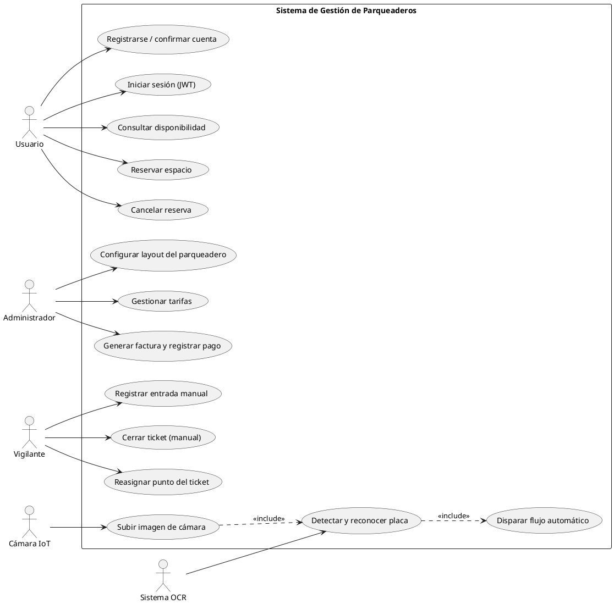

*Figura 1. Diagrama de casos de uso del sistema de gestión de parqueaderos.*

*Fuente: Elaboración propia.*

## **3.2. Aplicación de la Fase II: Diseño**

En esta sección se presenta el diseño del sistema propuesto, describiendo la estructura general de la solución y los componentes que la conforman. Se abordan aspectos como la arquitectura del sistema, el diseño del modelo de datos y la representación visual de la API, con el objetivo de definir cómo se implementarán los requerimientos identificados en la etapa de análisis.

### **3.2.1. Diagrama de arquitectura propuesta del sistema**

En esta sección se presenta la arquitectura propuesta del sistema, la cual describe la organización general de sus componentes y la forma en que interactúan entre sí.

**Figura 2.**

*Diagrama de arquitectura propuesta del sistema*

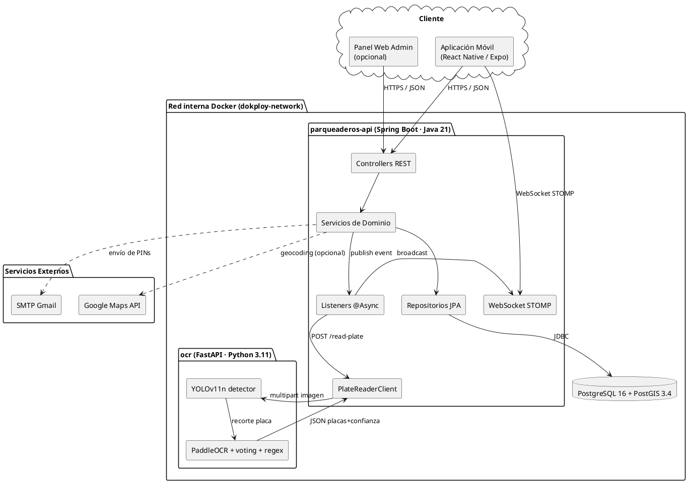

*Figura 2. Diagrama de arquitectura propuesta del sistema.*

*Fuente: Elaboración propia.*

El sistema implementa una arquitectura cliente-servidor organizada en cuatro capas funcionales, permitiendo separar las responsabilidades de presentación, procesamiento, servicios externos y almacenamiento de datos.

En la **capa de cliente** se encuentra la aplicación móvil desarrollada con React Native y Expo, así como un panel web administrativo opcional. Ambos clientes consumen la API REST publicada por el backend y se suscriben a los tópicos de WebSocket STOMP para recibir las actualizaciones en tiempo cercano al real. La aplicación móvil constituye el punto de interacción directa con el usuario final.

La **capa de servicios externos** integra la API de Google Maps, encargada de proporcionar servicios de geolocalización y representación cartográfica para la visualización de parqueaderos cercanos, y el servidor SMTP de Gmail, encargado del envío de los PINs de confirmación de cuenta y recuperación de contraseña.

El **backend** funciona como servidor central del sistema mediante una API REST de aproximadamente 138 endpoints, gestionando las solicitudes provenientes del cliente, coordinando el acceso a la base de datos y procesando la lógica de negocio. La comunicación se realiza principalmente mediante respuestas en formato JSON envueltas en un wrapper estándar `ApiResponse<T>` con los campos `success`, `message`, `data` y `timestamp`. Los eventos de cambio de estado se propagan a través de WebSocket STOMP usando tópicos públicos (`/topic/parqueadero/{id}`) y colas privadas por usuario (`/queue/usuario/{id}`).

El **sidecar OCR** se ubica en la misma red privada Docker que el backend pero no se expone al exterior. Recibe peticiones HTTP `multipart/form-data` con la imagen capturada por la cámara, ejecuta el detector YOLOv11n para localizar la placa dentro de la imagen y aplica PaddleOCR sobre tres variantes de preprocesamiento (original, brillo aumentado y suavizado bilateral) para extraer los caracteres. El resultado final se obtiene mediante votación por mayoría y filtrado por expresión regular del formato `[A-Z]{3}[0-9]{3}` correspondiente a las placas colombianas.

Finalmente, la **capa de datos** almacena la información del sistema mediante PostgreSQL 16 enriquecido con la extensión PostGIS 3.4, lo que permite manejar geometrías de tipo `POINT` (ubicación de parqueaderos sobre el mapa) y `POLYGON` (forma física de los puntos de parqueo). La base de datos reside también en la red privada Docker y no se expone al exterior.

### **3.2.2. Diseño del modelo de datos y de la API**

Para el diseño del modelo de datos se elaboró un diagrama entidad-relación que representa las entidades principales del dominio y las relaciones jerárquicas entre ellas. Adicionalmente, se documentó la API REST mediante OpenAPI 3 (springdoc-openapi), generando automáticamente una interfaz Swagger UI accesible en `/swagger-ui.html`.

A continuación, se presenta el diagrama entidad-relación principal; la especificación completa se encuentra disponible en el [**Anexo D.**](#anexo-d-diagramas-del-modelo-de-datos)

**Figura 3.**

*Diagrama entidad-relación del modelo de datos jerárquico*

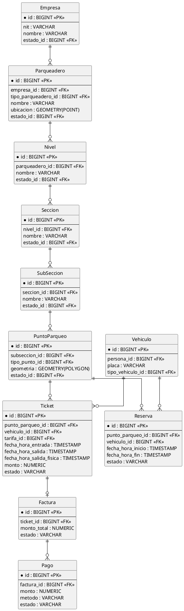

*Figura 3. Diagrama entidad-relación del modelo de datos jerárquico.*

*Fuente: Elaboración propia.*

La documentación interactiva de la API REST se genera automáticamente mediante springdoc-openapi a partir de las anotaciones de Spring y se publica en la ruta `/swagger-ui.html`. Esta interfaz permite explorar cada uno de los 138 endpoints, ver el esquema esperado de las peticiones y respuestas, y ejecutar peticiones de prueba autenticadas con un token JWT.

**Figura 4.**

*Vista conceptual de la interfaz Swagger UI publicada por el backend*

`[CAPTURA PENDIENTE: Captura de pantalla de Swagger UI en /swagger-ui.html del entorno de producción mostrando la lista colapsada de los 16 controladores con sus respectivos endpoints]`

*Figura 4. Vista conceptual de la interfaz Swagger UI publicada por el backend.*

*Fuente: Elaboración propia.*

A modo de ilustración, la Tabla 7 presenta cinco ejemplos representativos de endpoints expuestos por el backend con sus respectivos métodos HTTP, cuerpos de petición y respuestas esperadas.

**Tabla 7**
*Ejemplos representativos de endpoints REST publicados por el backend*

| Endpoint | Método | Petición (resumida) | Respuesta (resumida) |
| ----- | :---: | ----- | ----- |
| `/api/auth/login` | POST | `{ "correo": "u@x.co", "password": "..." }` | `{ "accessToken": "...", "refreshToken": "...", "usuario": { ... } }` |
| `/api/parqueaderos/{id}/disponibilidad` | GET | — | `{ "total": 50, "disponibles": 38, "ocupados": 10, "reservados": 2 }` |
| `/api/tickets` | POST | `{ "parqueaderoId": 7, "puntoParqueoId": 42, "vehiculoId": 18, "tarifaId": 3 }` | `{ "id": 99, "estado": "EN_CURSO", "fechaHoraEntrada": "2026-05-25T08:30:00Z" }` |
| `/api/tickets/{id}/salida` | PATCH | — | `{ "id": 99, "estado": "CERRADO", "monto": 4500.00, "duracion": "01:30:00" }` |
| `/api/camaras/{id}/imagen` | POST (multipart) | `imagen=<archivo JPG>` | `{ "imagenUrl": "/images/cam-12.jpg", "timestamp": "2026-05-25T08:30:05Z" }` |

*Fuente: Elaboración propia.*

## **3.3. Aplicación de la Fase III: Implementación**

En esta sección se describe el proceso de implementación del sistema, haciendo énfasis en el desarrollo del backend transaccional y del sidecar de visión artificial. Se detallan las tecnologías utilizadas, la estructura del proyecto y los principales módulos desarrollados.

### **3.3.1. Tecnologías utilizadas**

Para el desarrollo del sistema se utilizaron tecnologías orientadas a la construcción de servicios REST con persistencia transaccional, mensajería en tiempo cercano al real y observabilidad integrada, así como un módulo de visión por computador basado en aprendizaje profundo. La Tabla 8 presenta las herramientas y librerías utilizadas durante la implementación, con sus versiones específicas.

**Tabla 8**
*Tecnologías utilizadas*

| Componente | Tecnología | Versión | Uso |
| :---: | :---: | :---: | ----- |
| Lenguaje (backend) | Java | 21 (Temurin) | Lenguaje principal del backend con soporte de virtual threads y *records*. |
| Framework (backend) | Spring Boot | 3.5.10 | Framework empresarial con autoconfiguración y starters integrados. |
| Persistencia | PostgreSQL + PostGIS | 16 / 3.4 | Motor relacional con soporte de geometrías. |
| ORM | Hibernate / Spring Data JPA | 6.6.41 | Mapeo objeto-relacional y repositorios derivados. |
| Seguridad | Spring Security + JJWT | 6.5.7 / 0.12.6 | Autenticación stateless basada en JWT. |
| WebSocket | Spring Messaging STOMP | 6.2.15 | Mensajería en tiempo cercano al real sobre WebSocket. |
| Cache | Spring Cache (ConcurrentMap) | 6.x | Caché en memoria de catálogos de baja frecuencia. |
| Documentación | springdoc-openapi | 2.x | Generación automática de Swagger UI. |
| Build | Apache Maven | 3.9 | Gestión de dependencias y construcción del JAR. |
| Lenguaje (sidecar) | Python | 3.11 | Lenguaje del módulo de visión por computador. |
| API (sidecar) | FastAPI + Uvicorn | 0.115 / 0.34 | Framework HTTP asíncrono y servidor ASGI. |
| Detección | Ultralytics YOLO | ≥ 8.0 | Detector de placas vehiculares. |
| OCR | PaddleOCR + PaddlePaddle | ≥ 2.7 / ≥ 2.6 | Reconocimiento óptico de caracteres. |
| Visión | OpenCV (headless) | ≥ 4.6 | Transformaciones de imagen y preprocesamiento. |
| Contenedores | Docker + Docker Compose | — | Empaquetado y orquestación local. |
| Despliegue | Dokploy + GHCR | — | Orquestación de producción y registro de imágenes. |

*Fuente: Elaboración propia.*

### **3.3.2. Estructura del proyecto**

La estructura del proyecto se organizó de manera modular con el objetivo de facilitar la escalabilidad, mantenibilidad y separación de responsabilidades dentro del sistema. El código fuente del backend reside en el paquete raíz `com.usco.parqueaderos_api`, organizado en 14 sub-paquetes funcionales, cada uno con su correspondiente conjunto de entidades, repositorios, servicios y controladores.

El paquete `auth` concentra la lógica de registro, confirmación de cuenta por PIN, inicio de sesión, generación y rotación de tokens JWT, y recuperación de contraseña. El paquete `user` contiene las entidades Usuario, Persona y los roles asignados a cada usuario, mientras que `parking` aloja todo el modelo jerárquico del parqueadero: Empresa, Parqueadero, Nivel, Sección, SubSección, PuntoParqueo, así como las cámaras asociadas y la operación bulk-save del layout.

El paquete `ticket` implementa el ciclo de vida del ticket de parqueo, incluyendo tanto el flujo manual como el flujo automático disparado por OCR. El paquete `reservation` gestiona las reservas por intervalo de tiempo; `tariff` calcula los montos a cobrar en función de la duración del ticket y el tipo de vehículo; `billing` aloja las facturas y los pagos asociados; `vehicle` contiene los vehículos vinculados a personas; `device` modela los dispositivos IoT genéricos (sensores, cámaras, barreras); `catalog` reúne los catálogos de baja cardinalidad (estados, roles, tipos de vehículo, tipos de parqueadero, tipos de punto, tipos de dispositivo); `location` modela la jerarquía geográfica País → Departamento → Ciudad; `notification` implementa los listeners asíncronos que reaccionan a los eventos de dominio y publican los mensajes WebSocket; `ocr` aloja el cliente HTTP al sidecar y el listener `OcrEventListener` que dispara el flujo automático; finalmente `common` reúne componentes transversales como excepciones globales, el wrapper `ApiResponse`, la configuración de CORS, los endpoints de salud, la configuración del cache y del thread pool, y el componente de almacenamiento de imágenes en disco.

A continuación, se presenta la estructura del proyecto implementada en el entorno de desarrollo:

**Figura 5.**
*Estructura de paquetes del backend Spring Boot*

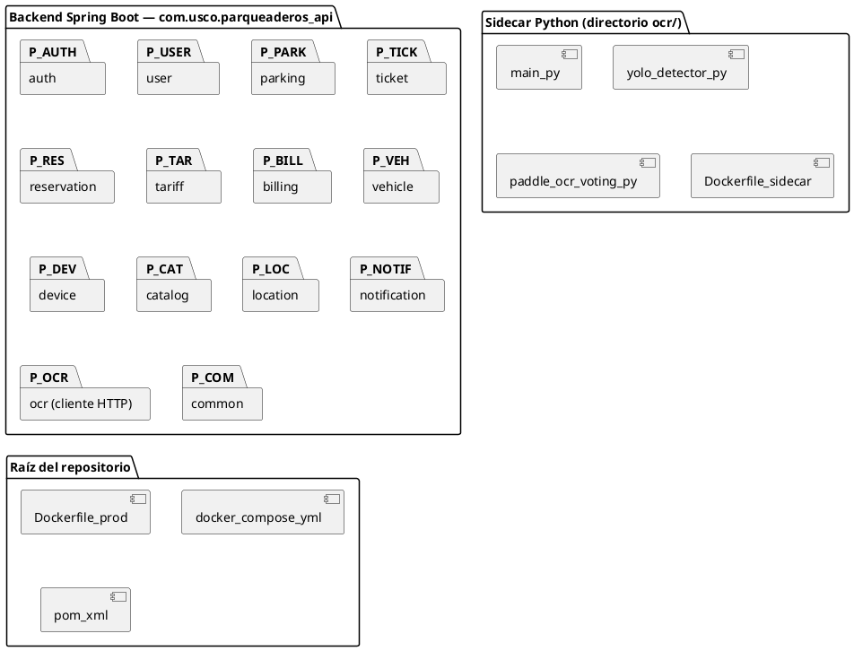

*Figura 5. Estructura de paquetes del backend Spring Boot.*

*Fuente: Elaboración propia.*

Métricas estructurales del proyecto: 16 controladores REST, 32 servicios de dominio, 29 repositorios JPA, aproximadamente 138 endpoints REST y 60 pruebas unitarias distribuidas en 5 archivos de prueba.

Esta organización permite una separación clara entre la lógica de negocio, la persistencia, los listeners asíncronos y los componentes transversales, facilitando el mantenimiento y la evolución independiente de cada módulo.

### **3.3.3. Módulo de autenticación y gestión de sesión**

El módulo de autenticación implementa un flujo completo de inicio de sesión basado en JSON Web Tokens (JWT), con soporte para rotación automática de tokens y persistencia segura de credenciales. La contraseña se almacena en la base de datos en formato BCrypt; el access token JWT está firmado con HMAC-SHA256 utilizando la clave secreta `JWT_SECRET` y tiene una duración de 1 hora; el refresh token es un UUID opaco persistido en la tabla `refresh_token` con una duración de 7 días.

Al ingresar sus credenciales, el sistema valida que la cuenta exista y esté confirmada, verifica el hash BCrypt de la contraseña, y emite el par de tokens. El access token se devuelve en el cuerpo de la respuesta junto con la información del usuario; el refresh token se devuelve en el mismo cuerpo para que el cliente lo almacene en su mecanismo de persistencia local (AsyncStorage en aplicaciones móviles, almacenamiento seguro en aplicaciones de escritorio, cookies HttpOnly en aplicaciones web).

**Figura 6.**
*Diagrama de secuencia del flujo de autenticación y rotación de refresh token*

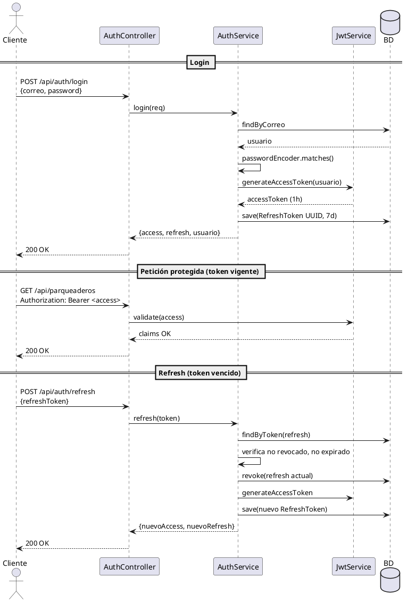

*Figura 6. Diagrama de secuencia del flujo de autenticación y rotación de refresh token.*

*Fuente: Elaboración propia.*

La aplicación cliente implementa un interceptor de respuesta en su cliente HTTP que detecta automáticamente errores 401 (token expirado o inválido). Ante este evento, el interceptor intenta renovar el access token utilizando el refresh token persistido. Si la renovación tiene éxito, la petición original se reintenta con el nuevo access token sin que el usuario perciba interrupción. Si la renovación falla (refresh token expirado o revocado), la sesión se elimina completamente y el usuario es redirigido a la pantalla de inicio de sesión.

La rotación del refresh token —donde cada uso del refresh emite uno nuevo y revoca el anterior— mitiga el riesgo de robo de token: si un atacante captura un refresh token y lo usa, el cliente legítimo no podrá usar su copia, lo que permite detectar el incidente. La autenticación stateless basada exclusivamente en el access token JWT habilita el escalado horizontal del backend sin necesidad de compartir sesión entre instancias.

`[CAPTURA PENDIENTE: Fragmento de código del método AuthService.refresh() mostrando la verificación del refresh token, la revocación del anterior y la emisión del nuevo par]`

### **3.3.4. Modelo de datos y mecanismos de borrado lógico**

El modelo de datos se implementó sobre PostgreSQL 16 con la extensión PostGIS 3.4. La imagen Docker utilizada es `postgis/postgis:16-3.4-alpine`, lo que garantiza la disponibilidad de las funciones espaciales (`ST_Distance`, `ST_Contains`, `ST_DWithin`) sin pasos adicionales de configuración.

Las entidades estructurales se organizan en una jerarquía bajo la entidad raíz `Empresa`, conforme al diagrama presentado en la sección 3.2.2. La cardinalidad de las relaciones se diseñó para soportar configuraciones realistas: una empresa puede operar múltiples parqueaderos en distintas ciudades; un parqueadero puede tener múltiples niveles (sótano, planta baja, primer piso); cada nivel se subdivide en secciones (por ejemplo, sección A, B, C); cada sección se subdivide en subsecciones (por ejemplo, A1, A2, A3); cada subsección contiene los puntos de parqueo físicos representados como polígonos geometrizados.

**Figura 7.**
*Diagrama de estados de la entidad Ticket*

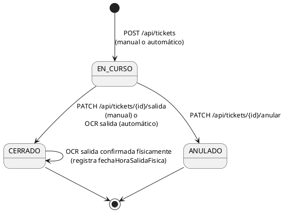

*Figura 7. Diagrama de estados de la entidad Ticket.*

*Fuente: Elaboración propia.*

Las entidades de negocio utilizan un catálogo `estado` con tres valores (ACTIVO, INACTIVO, ARCHIVADO) en lugar de booleanos, para mantener uniformidad y permitir la incorporación futura de estados adicionales sin alterar el esquema. Las transiciones permitidas se documentan en la Tabla 9.

**Tabla 9**
*Estados y transiciones de las principales entidades del dominio*

| Entidad | Estados posibles | Transición típica |
| ----- | ----- | ----- |
| `Ticket` | EN_CURSO → CERRADO o ANULADO | El backend asigna fechas y monto autoritativamente. |
| `Reserva` | PENDIENTE → CONFIRMADA → CANCELADA / EXPIRADA | Transiciones validadas en `ReservaService`. |
| `Factura` | PENDIENTE → PAGADA / ANULADA | Generada al cerrar el ticket. |
| `Pago` | COMPLETADO / PENDIENTE / RECHAZADO | Registrado por el operador o por la pasarela de pagos. |

*Fuente: Elaboración propia.*

Las entidades estructurales (Empresa, Parqueadero, Nivel, Sección, SubSección, PuntoParqueo) no se eliminan físicamente. En su lugar, se utilizan endpoints `PATCH /{id}/archivar` que cambian `estado_id` al valor `ARCHIVADO`. Esto preserva la integridad referencial con tickets y facturas históricos, evitando la pérdida de datos contables y de auditoría. El borrado masivo en cascada (al archivar un parqueadero completo, por ejemplo) usa consultas `@Modifying @Query` de tipo `UPDATE ... WHERE` (una por tipo de entidad hija), evitando recorrer N registros y emitir N saves individuales, lo que reduce la latencia de la operación de O(N) a O(1) en términos de roundtrips a la base de datos.

Para prevenir condiciones de carrera en la asignación de puntos —dos tickets EN_CURSO simultáneos sobre el mismo punto— se aplican dos mecanismos complementarios:

1. **Bloqueo pesimista** sobre el punto destino (`SELECT ... FOR UPDATE`) en los métodos `TicketService.save` y `TicketAutoService.buscarYLockearPuntoLibre`, que serializa las transacciones que compiten por el mismo recurso.
2. **Índice único parcial** en la tabla `ticket` con la condición `WHERE estado = 'EN_CURSO'`, que actúa como red de seguridad a nivel del motor de base de datos: si dos transacciones lograran burlar el bloqueo pesimista (por ejemplo, por una mala configuración del nivel de aislamiento), el motor rechazaría la segunda inserción con una violación de unicidad.

Por último, el archivo `src/main/resources/data.sql` ejecuta una carga inicial idempotente (`ON CONFLICT DO NOTHING`) de los catálogos base: tres estados, tres roles (USER, ADMIN, SUPER_ADMIN), tres tipos de vehículo (Carro, Moto, Bicicleta), tres tipos de parqueadero (Público, Privado, Mixto), tres tipos de punto de parqueo, tres tipos de dispositivo, un país (Colombia), cinco departamentos y diez ciudades. Esto garantiza que cualquier despliegue limpio del sistema disponga del conjunto mínimo de datos requerido para iniciar la operación.

### **3.3.5. Módulo de gestión multi-tenant de parqueaderos**

El backend implementa un modelo multi-tenant suave (*soft multi-tenancy*) en el que la pertenencia de cada recurso a una empresa se determina por la columna `empresa_id` propagada desde la entidad raíz. La capa de servicio recupera el `empresa_id` del usuario autenticado a través del componente `CurrentUserService` y lo añade automáticamente a los filtros de búsqueda y a los insertos. De esta manera, un usuario asociado a la empresa A nunca puede leer ni modificar recursos de la empresa B, aun cuando intente acceder a un identificador válido perteneciente a otra empresa.

El control de acceso por roles (RBAC) se implementa mediante anotaciones declarativas `@PreAuthorize("hasAnyRole(...)")` sobre los endpoints administrativos, complementado con verificaciones programáticas en los servicios cuando la lógica de autorización depende del estado del recurso (por ejemplo, "solo el dueño del ticket puede cerrarlo").

**Figura 8.**
*Diagrama de secuencia del flujo de validación multi-tenant + RBAC*

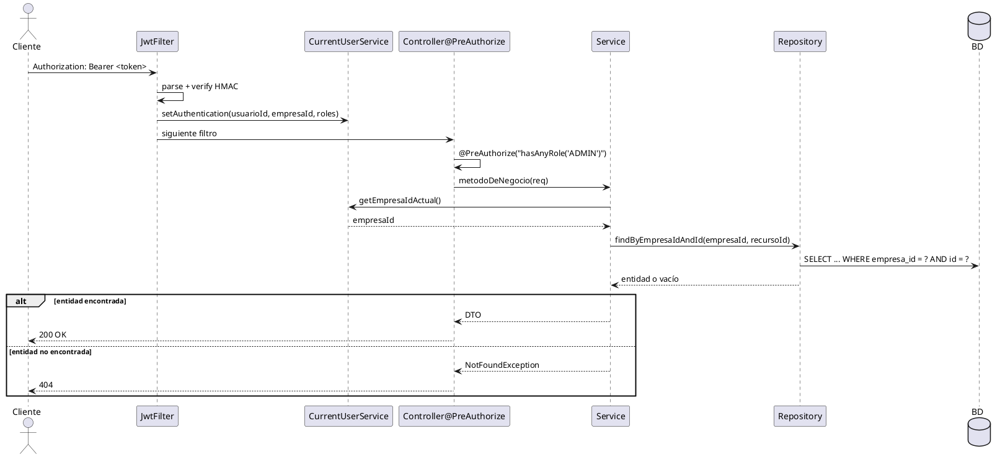

*Figura 8. Diagrama de secuencia del flujo de validación multi-tenant + RBAC.*

*Fuente: Elaboración propia.*

Adicionalmente, para evitar problemas de inicialización perezosa al serializar las respuestas (`LazyInitializationException` o errores de ByteBuddy con `_$$_jvst...`), los servicios mapean todas las entidades JPA con asociaciones `@ManyToOne(LAZY)` a DTOs dentro de la misma transacción `@Transactional`. Los controladores devuelven exclusivamente DTOs envueltos en `ApiResponse<T>`, garantizando que ningún proxy de Hibernate llegue al serializador Jackson. Esta convención se aplica de manera sistemática en los 16 controladores del proyecto.

### **3.3.6. Sistema de tickets manuales y reservas**

El módulo de tickets implementa el ciclo completo de entrada y salida de vehículos al parqueadero, tanto en su modalidad manual (operada por un vigilante o administrador) como en su modalidad automática (disparada por la detección de placa). Esta sección se centra en el flujo manual; el flujo automático se describe en detalle en la sección 3.3.9.

El flujo manual se inicia mediante una petición `POST /api/tickets` con el cuerpo `{ parqueaderoId, puntoParqueoId, vehiculoId, tarifaId }`. El servicio `TicketService` ejecuta la operación dentro de una transacción que adquiere un bloqueo pesimista sobre el punto de parqueo destino, verifica que el punto esté libre y que pertenezca al mismo parqueadero, y crea el ticket en estado `EN_CURSO` con `fechaHoraEntrada` igual al momento del servidor. Tras commitear la transacción, se publica un `TicketCreadoEvent` consumido por un listener `@Async` que emite los eventos WebSocket correspondientes (`TICKET_CREADO`, `SPOT_STATUS_CHANGE` con estado `occupied`, y `OCUPACION_ACTUALIZADA`).

El cierre del ticket se realiza mediante `PATCH /api/tickets/{id}/salida`. El servicio recupera el ticket, calcula el monto delegando en `TarifaCalculatorService` (que considera la duración en horas/minutos y el tipo de vehículo), establece el estado `CERRADO` y la fecha `fechaHoraSalida`, y crea automáticamente una `Factura` asociada. Se publica entonces un `TicketCerradoEvent` que dispara los eventos `TICKET_CERRADO`, `SPOT_STATUS_CHANGE` con estado `free` y `OCUPACION_ACTUALIZADA`.

**Figura 9.**
*Diagrama de secuencia del flujo manual de entrada y salida*

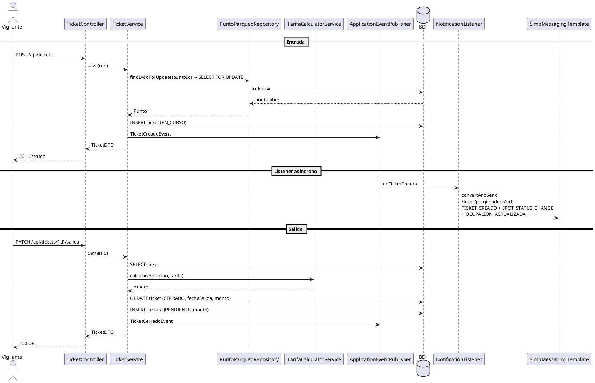

*Figura 9. Diagrama de secuencia del flujo manual de entrada y salida.*

*Fuente: Elaboración propia.*

El módulo de reservas (`ReservationService`) implementa una lógica análoga: el usuario reserva un punto para un intervalo `[fechaHoraInicio, fechaHoraFin]`, el sistema verifica que no exista solapamiento con otras reservas activas para el mismo punto, y crea la reserva en estado `PENDIENTE`. Una tarea programada (`@Scheduled`) expira las reservas no usadas y libera el punto. Las reservas también publican eventos (`ReservaCreadaEvent`, `ReservaCanceladaEvent`) que generan los correspondientes mensajes WebSocket.

La operación de **reasignación manual del punto** (PATCH `/api/tickets/{id}/punto`) permite al operador corregir el cubículo asignado por el flujo automático cuando el conductor estaciona en un lugar distinto al previsto. El backend valida que el ticket esté `EN_CURSO`, que el punto destino pertenezca al mismo parqueadero, que no esté archivado y que esté libre (mediante bloqueo pesimista). Si la validación es exitosa, libera el punto anterior, ocupa el nuevo, y emite los eventos `SPOT_STATUS_CHANGE` (free sobre el anterior, occupied sobre el nuevo) y `TICKET_PUNTO_CAMBIADO` con los identificadores de ambos puntos.

### **3.3.7. Sistema de notificaciones en tiempo real (WebSocket STOMP)**

Para reflejar el estado del parqueadero en tiempo cercano al real sin requerir consultas activas por parte del cliente, el sistema implementa una capa de notificaciones basada en WebSocket con el protocolo STOMP sobre SockJS. El backend expone un endpoint `/ws` que actúa como punto de entrada para las suscripciones, y publica los eventos en dos tipos de destinatarios: tópicos públicos por parqueadero (`/topic/parqueadero/{id}`) y colas privadas por usuario (`/queue/usuario/{id}`).

El cliente se autentica al establecer la conexión WebSocket usando el access token JWT en el header de conexión STOMP. El backend valida el token y registra la asociación entre la sesión WebSocket y el usuario autenticado, lo que permite enviar mensajes privados al usuario sin que otros suscriptores los reciban.

La Tabla 10 documenta los ocho eventos emitidos por el backend, con el tópico o cola en que se publican y la estructura del campo `data` del mensaje.

**Tabla 10**
*Eventos WebSocket emitidos por el backend*

| Evento | Destino | Contenido del campo `data` |
| ----- | ----- | ----- |
| `TICKET_CREADO` | `/topic/parqueadero/{id}` | (vacío; el WS solo notifica el cambio) |
| `TICKET_CERRADO` | `/topic/parqueadero/{id}` | (vacío) |
| `TICKET_PUNTO_CAMBIADO` | `/topic/parqueadero/{id}` | `{ ticketId, puntoParqueoAnteriorId, puntoParqueoNuevoId }` |
| `SPOT_STATUS_CHANGE` | `/topic/parqueadero/{id}` | `{ puntoParqueoId, subseccionId, estado: free\|occupied\|reserved, ticketId }` |
| `OCUPACION_ACTUALIZADA` | `/topic/parqueadero/{id}` | `{ total, disponibles, ocupados, reservados }` |
| `CAMERA_IMAGE_UPDATED` | `/topic/parqueadero/{id}` | `{ cameraId, imagenUrl, timestamp }` |
| `PLACA_DETECTADA` | `/topic/parqueadero/{id}` | `{ placa, confianza, cameraId, tipoCamara, detectedAt, accion, ticketId, vehiculoId, vehiculoCreado, puntoParqueoId, montoCalculado, mensaje }` |
| `RESERVA_CREADA` | `/queue/usuario/{id}` | (vacío) |

*Fuente: Elaboración propia.*

**Figura 10.**
*Diagrama de secuencia del flujo de notificación WebSocket*

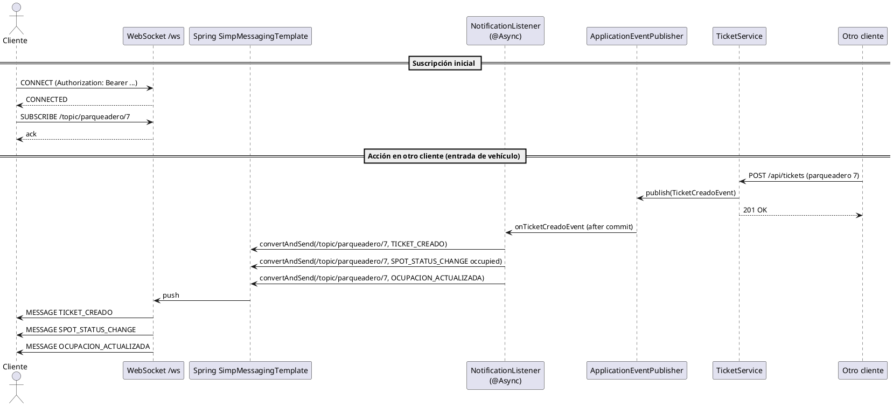

*Figura 10. Diagrama de secuencia del flujo de notificación WebSocket.*

*Fuente: Elaboración propia.*

Los listeners se ejecutan con la fase de transacción `@TransactionalEventListener(phase = TransactionPhase.AFTER_COMMIT)`. Esto garantiza que los mensajes solo se emitan después de que la transacción que generó el evento haya sido confirmada exitosamente, evitando inconsistencias en las que el cliente recibe una notificación de un cambio que luego fue revertido por un rollback. Adicionalmente, los listeners se ejecutan en un pool de threads acotado (`ThreadPoolTaskExecutor` con `corePoolSize=4`, `maxPoolSize=16`, `queueCapacity=100`, política de saturación `CallerRunsPolicy`), lo que limita la concurrencia y aplica retro-presión sobre el productor cuando el sistema está bajo carga.

### **3.3.8. Módulo de visión artificial: detector YOLOv11n y OCR PaddleOCR**

Esta sección presenta el módulo de visión por computador, encargado de detectar y reconocer las placas vehiculares presentes en las imágenes capturadas por las cámaras de entrada, salida y seguridad del parqueadero.

**Caso de uso y métrica prioritaria.** El sistema requiere que la **misma placa produzca la misma cadena al entrar y al salir** del parqueadero, aun cuando la lectura no sea literalmente correcta. Esto permite identificar al vehículo contra la base de datos sin importar si hay un error sistemático en uno o dos caracteres. Por esta razón, la métrica prioritaria del módulo es la **consistencia** (mismo string a través de variaciones de iluminación, ángulo y ruido), mientras que la precisión literal (lectura exacta de la placa real) es secundaria.

**Dataset.** Se utilizó el dataset *Number Plate v4* de Roboflow (`universe.roboflow.com/usco-thj9e/number-plate-hiu16`), compuesto por 4 201 imágenes anotadas en formato YOLO, con la siguiente distribución: 3 592 imágenes para entrenamiento, 346 para validación y 263 para prueba. El preprocesamiento aplicado al dataset comprende la auto-orientación EXIF y el redimensionamiento a 640 × 640 píxeles con padding negro para preservar la relación de aspecto sin distorsionar las placas.

**Detector YOLOv11n.** Se partió del modelo base `yolo11n.pt` (variante *nano*, 2.6 M parámetros) y se ejecutó un fine-tuning sobre el dataset descrito. Los hiperparámetros del entrenamiento se documentan en la Tabla 11.

**Tabla 11**
*Hiperparámetros del entrenamiento del detector YOLOv11n*

| Parámetro | Valor |
| ----- | ----- |
| Épocas configuradas | 20 |
| Épocas reales (early stop) | 11 |
| Batch size | 8 |
| Image size | 640 |
| Optimizer | SGD (auto) con momentum 0.937 |
| Learning rate inicial | `lr0 = 0.01` |
| Learning rate final | `lrf = 0.01` (decay coseno) |
| Device | CPU |
| Augmentation | mosaic 1.0, fliplr 0.5, hsv_h 0.015, scale 0.5 |

*Fuente: Elaboración propia.*

Las métricas finales obtenidas sobre el conjunto de validación se presentan en la Tabla 12.

**Tabla 12**
*Métricas finales del detector YOLOv11n sobre el conjunto de validación*

| Métrica | Valor |
| ----- | ----- |
| **mAP50** | **0.987** |
| **mAP50-95** | **0.820** |
| **Precision** | **0.998** |
| **Recall** | **1.000** |
| Box loss | 0.694 |
| Class loss | 0.418 |

*Fuente: Elaboración propia.*

Sobre el conjunto de 12 placas reales utilizado para el benchmark, el detector recorta correctamente las 12 (100 % de recall). El detector no constituye el cuello de botella del sistema.

**Entrenamientos propios de OCR (descartados).** Se intentaron dos arquitecturas con un dataset balanceado de 8 611 imágenes de entrenamiento, 1 076 de validación y 1 077 de prueba, con 300 imágenes por clase y 36 clases (0–9 y a–z). El pipeline diseñado fue: `YOLO → recorte → segmentación de caracteres por contornos (cv2.adaptiveThreshold + findContours) → clasificación carácter por carácter`. Los resultados se resumen en las Tablas 13 y 14.

**Tabla 13**
*Resultados de ResNet50 entrenada localmente*

| Corrida | Test accuracy (sintético) | 12 placas reales |
| ----- | ----- | ----- |
| ep20 | **0.967** | 0 / 12 |
| ep30 | 0.918 | 0 / 12 |
| ep45 | 0.901 | 0 / 12 |
| ep60 | 0.880 | 0 / 12 |

*Fuente: Elaboración propia.*

**Causa raíz del fracaso de ResNet50:** la segmentación por contornos colapsa en placas reales por sombras irregulares, brillos especulares, suciedad acumulada y deterioro del sticker. El modelo recibe trozos rotos en lugar de caracteres limpios y clasifica fielmente lo que recibe, pero recibe basura. La precisión alta sobre el conjunto sintético es engañosa porque ese conjunto fue generado a partir de la misma segmentación, eliminando precisamente la fuente del error en producción.

**Tabla 14**
*Resultados de EfficientNet-B0 entrenada localmente*

| Experimento | Batch / LR / Aug | Test accuracy | 12 placas reales |
| ----- | :---: | ----- | ----- |
| ExpA | 32 / 1e-3 / mild | 0.028 | 0 / 12 |
| ExpB | 32 / 1e-4 / strong | 0.028 | 0 / 12 |
| ExpC | 64 / 5e-4 / mild | 0.028 | 0 / 12 |
| ExpD | 64 / 1e-4 / none | 0.029 | 0 / 12 |

*Fuente: Elaboración propia.*

**Bug identificado en EfficientNet-B0:** `ImageDataGenerator(rescale=1./255)` es incompatible con `EfficientNetB0(weights='imagenet')`. EfficientNet espera la entrada en rango `[0, 255]` y aplica su propia normalización interna mediante `tensorflow.keras.applications.efficientnet.preprocess_input`. La escala manual destruye la información que el modelo espera, lo que explica el colapso a `accuracy ≈ 0.028`, equivalente a azar (1/36). El bug está documentado y arreglado en el script de entrenamiento, pero el reentrenamiento queda como trabajo futuro.

**Benchmark de soluciones de OCR.** Se compararon cinco soluciones externas y la solución propia con mejor desempeño en el conjunto sintético (ResNet50 ep20, accuracy 0.967). Para cada placa real se generaron cinco variaciones que simulan condiciones reales de entrada y salida (Tabla 15).

**Tabla 15**
*Variaciones de imagen aplicadas a cada placa real*

| Variación | Transformación |
| ----- | ----- |
| v0 original | Recorte de YOLO sin alterar. |
| v1 bright | `convertScaleAbs(α=1.2, β=10)` (simula mediodía soleado). |
| v2 dark | `convertScaleAbs(α=0.8, β=-10)` (simula atardecer). |
| v3 zoom_out | Recorte distinto del YOLO (10 % más alrededor de la placa). |
| v4 noisy | Ruido gaussiano `σ=12` (simula foto borrosa). |

*Fuente: Elaboración propia.*

Total: 12 placas × 5 variaciones = **60 imágenes**.

Las métricas evaluadas son:

* **Consistencia:** las 5 variaciones de una misma placa producen exactamente el mismo string.
* **Mayoría correcta:** al menos 3 de las 5 lecturas coinciden con el ground truth.
* **Accuracy literal:** las 5 lecturas coinciden con el ground truth.

Los resultados se resumen en la Tabla 16.

**Tabla 16**
*Resultados del benchmark de soluciones de OCR sobre 60 imágenes*

| Rank | OCR | Consistencia | Mayoría correcta | Latencia | Veredicto |
| :---: | ----- | ----- | ----- | ----- | ----- |
| 1 | **PaddleOCR v2** (voting + filtro) | **100 % (12/12)** | **83 % (10/12)** | 2.4 s/img | Ganador |
| 2 | EasyOCR | 67 % (8/12) | 50 % (6/12) | 0.2 s/img | Alternativa rápida |
| 3 | PaddleOCR vanilla | 58 % (7/12) | 83 % (10/12) | 0.8 s/img | Buena precisión sin mejoras |
| 4 | Tesseract | 0 % (0/12) | 17 % (2/12) | 0.1 s/img | No detecta muchas |
| 5 | TrOCR (small-printed) | 8 % (1/12) | 0 % (0/12) | 0.07 s/img | Entrenado para documentos |
| 6 | docTR (Mindee) | 0 % (0/12) | 0 % (0/12) | 0.9 s/img | Entrenado para documentos |
| 7 | ResNet50 ep20 (propio) | — | 0 % (0/12) | — | Descartado |

*Fuente: Elaboración propia.*

El detalle por placa de la solución ganadora (PaddleOCR v2) se presenta en la Tabla 17.

**Tabla 17**
*Detalle por placa del benchmark de PaddleOCR v2 (solución ganadora)*

| Placa | Ground truth | v0 | v1 | v2 | v3 | v4 | Consistente | Literal |
| ----- | ----- | ----- | ----- | ----- | ----- | ----- | :---: | :---: |
| IMG_4489 | KJV807 | KJV807 | KJV807 | KJV807 | KJV807 | KJV807 | ✓ | ✓ |
| IMG_4490 | THS228 | THS228 | THS228 | THS228 | THS228 | THS228 | ✓ | ✓ |
| IMG_4491 | HFZ558 | HFZ558 | HFZ558 | HFZ558 | HFZ558 | HFZ558 | ✓ | ✓ |
| IMG_4492 | KSR750 | KSR750 | KSR750 | KSR750 | — | KSR750 | ✓ | ✓ |
| IMG_4493 | LUQ850 | LUQ850 | LUQ850 | LUQ850 | LUQ850 | LUQ850 | ✓ | ✓ |
| IMG_4494 | KDV643 | KDV643 | KDV643 | KDV643 | KDV643 | KDV643 | ✓ | ✓ |
| IMG_4495 | LUQ740 | LUQ740 | LUQ740 | LUQ740 | LUQ740 | LUQ740 | ✓ | ✓ |
| IMG_4496 | ELV526 | ELV526 | ELV526 | ELV526 | ELV526 | ELV526 | ✓ | ✓ |
| IMG_4497 | CGN789 | CGN789 | CGN789 | CGN789 | CGN789 | CGN789 | ✓ | ✓ |
| IMG_4498 | **GQX879** | GOX879 | GOX879 | GOX879 | GOX879 | GOX879 | ✓ | ✗ |
| IMG_4503 | **LOQ674** | LOO674 | LOO674 | LOO674 | LOO674 | LOO674 | ✓ | ✗ |
| IMG_4571 | FWV120 | FWV120 | FWV120 | FWV120 | FWV120 | FWV120 | ✓ | ✓ |

*Fuente: Elaboración propia.*

Los dos errores residuales son la confusión de la letra Q por la letra O, consistente en las cinco variaciones de la misma placa. Esto **no afecta** el caso de uso del parqueadero: si la placa entra como `LOO674`, sale como `LOO674`, y el match contra la base de datos del vehículo asociado es correcto.

`[CAPTURA PENDIENTE: Gráfica matplotlib comparativa de consistencia vs. precisión literal de las 7 soluciones evaluadas, generada por el script de benchmark]`

**Solución ganadora: PaddleOCR v2.** Tres mejoras sobre PaddleOCR vanilla:

1. **Preprocesamiento de tres variantes:**
   - Original (BGR sin alterar).
   - Brillante: `cv2.convertScaleAbs(img, alpha=1.15, beta=10)`.
   - Suavizado: `cv2.bilateralFilter(img, 9, 75, 75)`.

2. **Filtro por expresión regular** que descarta lecturas con basura (nombre de ciudad impresa en la placa, símbolos, banderines):

   ```python
   PLATE_REGEX       = re.compile(r"([A-Z]{3})\s*[\.\-·]?\s*(\d{3})")
   PLATE_LOOSE_REGEX = re.compile(r"([A-Z0]{3})\s*[\.\-·]?\s*(\d{3})")  # tolera Q→0→O
   ```

3. **Majority voting** sobre las 3 lecturas válidas, con confianza `votos_del_ganador / lecturas_válidas`. Se acepta el resultado si la confianza es ≥ 0.66 (al menos 2 de 3 variantes coincidieron).

**Figura 11.**
*Pipeline integrado de detección y reconocimiento de placas*

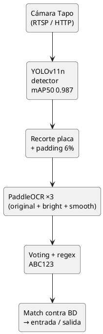

*Figura 11. Pipeline integrado de detección y reconocimiento de placas.*

*Fuente: Elaboración propia.*

La latencia total medida es de aproximadamente **2.5 s por imagen** (1280 × 720 → placa detectada y leída). El despliegue en producción usa `enable_mkldnn=False` en PaddleOCR para evitar un bug conocido (`ConvertPirAttribute2RuntimeAttribute not support`) que afecta ciertos CPUs cuando se combina el executor PIR con oneDNN.

### **3.3.9. Flujo automático de tickets disparado por OCR**

El flujo automático conecta la detección de placa con la lógica transaccional del backend. La sucesión completa de pasos es la siguiente:

1. Una cámara IoT envía la imagen capturada al backend mediante `POST /api/camaras/{id}/imagen` con el archivo como `multipart/form-data`.
2. El backend redimensiona la imagen a 1280 × 720 píxeles, la persiste en el directorio `/app/images`, actualiza el registro de la cámara con la nueva URL y emite el evento `CamaraImagenActualizadaEvent`.
3. Un listener asíncrono (`OcrEventListener`) consume el evento e invoca al sidecar mediante `PlateReaderClient.detect(camaraId, imagen)`.
4. El sidecar ejecuta el pipeline descrito en la sección 3.3.8 y devuelve las placas detectadas, su confianza por votación y las placas omitidas por cooldown.
5. Para cada placa detectada, el `TicketAutoService` aplica la lógica según el `TipoCamara` (ENTRADA, SALIDA, SEGURIDAD), creando, cerrando o anulando el ticket correspondiente.
6. Se publica un `PlacaDetectadaEvent` que se traduce en un mensaje WebSocket dirigido al tópico del parqueadero con el campo `accion` poblado.

**Figura 12.**
*Diagrama de secuencia del flujo automático de tickets disparado por OCR*

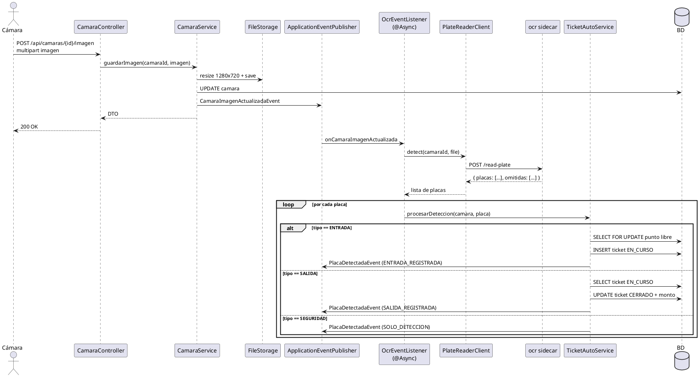

*Figura 12. Diagrama de secuencia del flujo automático de tickets disparado por OCR.*

*Fuente: Elaboración propia.*

El campo `accion` del evento `PLACA_DETECTADA` puede tomar siete valores, documentados en la Tabla 18.

**Tabla 18**
*Valores posibles del campo `accion` del evento PLACA_DETECTADA*

| Acción | Significado |
| ----- | ----- |
| `ENTRADA_REGISTRADA` | Vehículo entró, ticket creado y punto ocupado. |
| `ENTRADA_DUPLICADA` | Vehículo ya tenía ticket abierto en este parqueadero (se ignora). |
| `SALIDA_REGISTRADA` | Ticket cerrado y monto calculado. |
| `SALIDA_CONFIRMADA_FISICA` | Ticket ya estaba cerrado por el operador; la cámara confirma físicamente la salida y registra `fechaHoraSalidaFisica`. |
| `SALIDA_SIN_TICKET` | Vehículo saliendo sin haber entrado registrado (alerta de salida fantasma). |
| `SOLO_DETECCION` | Cámara de seguridad, sin acción sobre la base de datos. |
| `ERROR` | Fallo lógico (sin puntos libres, sin tarifa, configuración inconsistente). |

*Fuente: Elaboración propia.*

Esta arquitectura permite extender el sistema con nuevos tipos de cámara o nuevas reglas de negocio sin modificar el cliente HTTP al sidecar ni el módulo de visión por computador, ya que toda la lógica adicional se concentra en `TicketAutoService` y consume el resultado normalizado del sidecar.

## **3.4. Aplicación de la Fase IV: Pruebas del sistema**

En esta fase se verificó el correcto funcionamiento de los módulos implementados en el backend, el sidecar OCR y el flujo automático completo. Las pruebas se ejecutaron en tres niveles: unitarias (JUnit 5 + Mockito), de integración (con base de datos PostgreSQL real) y end-to-end (sobre el sistema desplegado en producción en `http://deploy.inmero.co:5445`). A continuación se describe cada caso de prueba ejecutado.

### **3.4.1. Prueba de autenticación con JWT y rotación de refresh token**

Esta prueba tuvo como objetivo verificar el correcto funcionamiento del proceso de autenticación, incluyendo la generación del par de tokens (access + refresh), la rotación del refresh token al renovar la sesión y la revocación del refresh token anterior.

Para ello, se ingresaron credenciales válidas en el endpoint `POST /api/auth/login` y se observó la respuesta. Posteriormente, se invocó `POST /api/auth/refresh` con el refresh token obtenido y se verificó que el backend devolviera un nuevo par de tokens, revocando el refresh token anterior.

El fragmento evaluado corresponde al método `AuthService.refresh` encargado de validar el refresh token entregado, revocar el registro anterior, emitir un nuevo access token JWT y persistir un nuevo refresh token UUID en la base de datos.

**Figura 13.**
*Fragmento del método AuthService.refresh*

`[CAPTURA PENDIENTE: Captura del método AuthService.refresh con el manejo de revocación e inserción del nuevo refresh token]`

*Figura 13. Fragmento del método AuthService.refresh.*

*Fuente: Elaboración propia.*

Los resultados confirmaron el comportamiento esperado: al ingresar credenciales válidas la aplicación emitió el par de tokens y navegó a la pantalla principal del cliente; al ingresar credenciales incorrectas, el backend respondió con HTTP 401 y un mensaje descriptivo. La rotación del refresh token operó conforme al diseño: el refresh anterior quedó marcado como revocado, y un intento posterior de usarlo devolvió HTTP 401. La prueba unitaria asociada (`AuthServiceTest`, 8 casos) cubre los caminos de éxito y los caminos de error.

### **3.4.2. Prueba de creación de ticket manual con bloqueo pesimista**

Esta prueba tuvo como objetivo verificar que la creación de un ticket sobre un punto de parqueo respete las precondiciones (punto libre, en el mismo parqueadero, no archivado) y que se utilice un bloqueo pesimista para prevenir condiciones de carrera entre transacciones concurrentes.

El fragmento evaluado corresponde al método `TicketService.save`, que adquiere un `SELECT ... FOR UPDATE` sobre el punto de parqueo destino antes de insertar el ticket.

**Figura 14.**
*Fragmento del método TicketService.save con bloqueo pesimista*

`[CAPTURA PENDIENTE: Captura del método TicketService.save con la llamada findByIdForUpdate y la validación del estado del punto]`

*Figura 14. Fragmento del método TicketService.save con bloqueo pesimista.*

*Fuente: Elaboración propia.*

La prueba unitaria `TicketServiceTest` (19 casos) cubre los escenarios de éxito (punto libre asignado), los escenarios de fallo (punto ocupado, punto archivado, punto de otro parqueadero) y la emisión de los eventos de dominio. Adicionalmente, se ejecutaron pruebas manuales de concurrencia disparando 10 peticiones simultáneas contra el mismo punto: una de ellas obtuvo un ticket EN_CURSO y las otras nueve recibieron HTTP 409 (conflicto), lo cual confirmó la serialización por bloqueo pesimista.

### **3.4.3. Prueba de cierre de ticket y cálculo automático del monto**

Esta prueba tuvo como objetivo verificar el cierre correcto del ticket y el cálculo automático del monto en función de la duración del ticket y la tarifa aplicada al tipo de vehículo.

El fragmento evaluado corresponde al método `TarifaCalculatorService.calcular`, que toma la fecha de entrada, la fecha de salida y la tarifa configurada, y devuelve el monto a cobrar en función del esquema de tarifas (por hora, por fracción mínima, con valor base).

**Figura 15.**
*Fragmento del método TarifaCalculatorService.calcular*

`[CAPTURA PENDIENTE: Captura del método TarifaCalculatorService.calcular ilustrando el redondeo a la fracción mínima y el cálculo del monto final]`

*Figura 15. Fragmento del método TarifaCalculatorService.calcular.*

*Fuente: Elaboración propia.*

La prueba unitaria `TarifaCalculatorServiceTest` (9 casos) cubre los escenarios de duración inferior a 1 hora, duración de varias horas, duración con fracción mínima al redondear, y configuración con valor base aplicado al primer rango. La prueba `PagoServiceTest` (8 casos) verifica el registro del pago y la transición de la factura a estado `PAGADA`.

### **3.4.4. Prueba del flujo automático OCR — entrada nueva**

Esta prueba tuvo como objetivo verificar que la detección de una placa por una cámara de tipo ENTRADA dispare correctamente la creación de un ticket nuevo, incluyendo la creación del vehículo invitado si no existe previamente en la base de datos.

El fragmento evaluado corresponde al método `TicketAutoService.procesarEntrada`, que invoca a `buscarYLockearPuntoLibre`, crea o recupera el vehículo, e inserta el ticket en estado `EN_CURSO`.

**Figura 16.**
*Fragmento del método TicketAutoService.procesarEntrada*

`[CAPTURA PENDIENTE: Captura del método TicketAutoService.procesarEntrada mostrando la validación de duplicado y la creación del ticket EN_CURSO]`

*Figura 16. Fragmento del método TicketAutoService.procesarEntrada.*

*Fuente: Elaboración propia.*

La prueba unitaria `TicketAutoServiceTest` (12 casos) cubre los caminos del flujo: entrada nueva con vehículo conocido, entrada nueva con vehículo desconocido (creación como invitado), entrada duplicada (vehículo con ticket abierto), entrada sin puntos libres, entrada sin tarifa configurada, salida normal, salida con cierre previo dentro de 5 minutos (SALIDA_CONFIRMADA_FISICA), salida sin ticket previo (SALIDA_SIN_TICKET), y eventos de cámara de seguridad. La prueba `AssignedSpotsReaderTest` (7 casos) verifica la consulta SQL nativa que lista los puntos ocupados con su ticket asociado.

### **3.4.5. Prueba del flujo automático OCR — salida confirmada físicamente**

Esta prueba tuvo como objetivo verificar el caso especial en el que el operador cierra manualmente el ticket de un vehículo, pero el vehículo aún no ha salido físicamente. Si una cámara de SALIDA detecta la placa dentro de los 5 minutos siguientes al cierre manual, el sistema no debe generar una alerta de salida fantasma sino registrar la salida física confirmada.

El fragmento evaluado corresponde a la rama del método `TicketAutoService.procesarSalida` que detecta si el último ticket del vehículo en el parqueadero fue cerrado hace menos de 5 minutos y, en ese caso, actualiza el campo `fechaHoraSalidaFisica` sin recobrar el monto.

**Figura 17.**
*Fragmento del método TicketAutoService.procesarSalida (rama de confirmación física)*

`[CAPTURA PENDIENTE: Captura del método TicketAutoService.procesarSalida ilustrando la rama que registra fechaHoraSalidaFisica cuando el ticket fue cerrado en los últimos 5 minutos]`

*Figura 17. Fragmento del método TicketAutoService.procesarSalida (rama de confirmación física).*

*Fuente: Elaboración propia.*

El evento `PLACA_DETECTADA` emitido tras la detección de la cámara de salida transportó el valor `SALIDA_CONFIRMADA_FISICA` en el campo `accion`, y el ticket se actualizó con el timestamp de la salida física sin alterar el monto cobrado. Este caso habilita la auditoría de los tiempos entre el cobro y la salida física.

### **3.4.6. Prueba de notificaciones WebSocket en tiempo real**

Esta prueba tuvo como objetivo verificar que los eventos de cambio de estado del parqueadero se reflejen en los clientes suscritos al tópico correspondiente sin necesidad de actualizar la interfaz manualmente.

Para ello, se conectó un cliente WebSocket al tópico `/topic/parqueadero/7` desde un script Python utilizando `stompy`, y se ejecutó una operación de creación de ticket desde Postman. Se verificó que el cliente WebSocket recibiera los tres mensajes esperados (`TICKET_CREADO`, `SPOT_STATUS_CHANGE` con estado `occupied`, `OCUPACION_ACTUALIZADA`) en menos de 200 ms.

El fragmento evaluado corresponde al listener `@TransactionalEventListener` encargado de consumir `TicketCreadoEvent` y emitir los tres mensajes WebSocket.

**Figura 18.**
*Fragmento del NotificationListener.onTicketCreado*

`[CAPTURA PENDIENTE: Captura del método NotificationListener.onTicketCreado con la fase AFTER_COMMIT y las tres invocaciones a SimpMessagingTemplate.convertAndSend]`

*Figura 18. Fragmento del NotificationListener.onTicketCreado.*

*Fuente: Elaboración propia.*

Los tres mensajes se entregaron al cliente en orden. Adicionalmente, se ejecutó una prueba complementaria de rollback: se forzó una excepción después de la inserción del ticket pero antes del commit; el cliente no recibió ningún mensaje, lo cual confirmó que la fase `AFTER_COMMIT` evita notificaciones de cambios que luego se revierten.

### **3.4.7. Prueba de degradación silenciosa del sidecar OCR**

Esta prueba tuvo como objetivo verificar el cumplimiento del RNF-04 (tolerancia a fallos del sidecar OCR): el backend debe continuar funcionando sin interrupciones cuando el sidecar no responda, devuelva un código de error o esté deshabilitado mediante la variable `OCR_ENABLED=false`.

El fragmento evaluado corresponde al cliente HTTP `PlateReaderClient`, que captura las excepciones de red, los códigos 4xx/5xx y los timeouts, y devuelve una lista vacía en lugar de propagar la excepción.

**Figura 19.**
*Fragmento del cliente PlateReaderClient con degradación silenciosa*

`[CAPTURA PENDIENTE: Captura del método PlateReaderClient.detect mostrando la captura de excepciones y el return de una lista vacía]`

*Figura 19. Fragmento del cliente PlateReaderClient con degradación silenciosa.*

*Fuente: Elaboración propia.*

La prueba unitaria `PlateReaderClientTest` (4 casos) simula los escenarios de sidecar caído (connection refused), respuesta 500, respuesta 200 con cuerpo válido y timeout. En los tres escenarios de fallo, el cliente devolvió una lista vacía sin lanzar excepciones, y la prueba `OcrEventListenerTest` (incluida en los 12 casos de `TicketAutoServiceTest`) verificó que el flujo principal de subida de imagen no falla cuando el sidecar no responde.

### **3.4.8. Prueba end-to-end del sistema desplegado en producción**

Esta prueba tuvo como objetivo validar el comportamiento del sistema completo desplegado en producción (`http://deploy.inmero.co:5445`) bajo siete escenarios reales que abarcan los siete posibles valores del campo `accion` del evento `PLACA_DETECTADA`.

Cada escenario se ejecutó manualmente subiendo una imagen real de cámara y observando la respuesta del backend, el contenido de la tabla `ticket` en la base de datos y el mensaje WebSocket emitido. Los resultados se resumen en la Tabla 19.

**Tabla 19**
*Resultados de los escenarios end-to-end ejecutados en producción*

| # | Escenario | Resultado esperado | Resultado obtenido |
| :---: | ----- | ----- | :---: |
| 1 | Cámara ENTRADA detecta placa nueva | `ENTRADA_REGISTRADA`, ticket creado, vehículo invitado creado | ✓ |
| 2 | Misma placa por otra cámara ENTRADA del mismo parqueadero | `ENTRADA_DUPLICADA` (no crea segundo ticket) | ✓ |
| 3 | Cámara SALIDA detecta placa con ticket EN_CURSO | `SALIDA_REGISTRADA`, ticket cerrado, monto calculado | ✓ |
| 4 | Cierre manual + cámara SALIDA dentro de 5 minutos | `SALIDA_CONFIRMADA_FISICA`, registra `fechaHoraSalidaFisica` | ✓ |
| 5 | PATCH `/api/tickets/{id}/punto` a otro punto | 2× `SPOT_STATUS_CHANGE` + `TICKET_PUNTO_CAMBIADO` por WS | ✓ |
| 6 | Cámara SEGURIDAD detecta placa | `SOLO_DETECCION`, no toca la base de datos | ✓ |
| 7 | Cámara SALIDA detecta placa sin ticket previo | `SALIDA_SIN_TICKET` (alerta de fantasma) | ✓ |

*Fuente: Elaboración propia.*

Los siete escenarios produjeron el resultado esperado, lo cual validó empíricamente la corrección del flujo automático. La latencia end-to-end medida (subida de imagen → mensaje WebSocket recibido por el cliente) fue de **3-5 segundos** en todos los escenarios, dentro del umbral establecido por el RNF-02. Las pruebas adicionales de carga (50 imágenes consecutivas a una tasa de 1 imagen/segundo por cámara) confirmaron que el thread pool acotado no se saturó y que la cola interna del pool absorbió los picos.

Métricas globales del backend al cierre de la fase de pruebas:

* 138 endpoints REST documentados con OpenAPI.
* 60 pruebas unitarias distribuidas en 7 archivos, todas pasando: `TicketAutoServiceTest` (12), `TicketServiceTest` (19), `PlateReaderClientTest` (4), `AssignedSpotsReaderTest` (7), `PagoServiceTest` (8), `TarifaCalculatorServiceTest` (9), `ParqueaderosApiApplicationTests` (1).
* Latencia end-to-end del flujo OCR: 3–5 s desde la subida de imagen hasta la emisión del evento `PLACA_DETECTADA` por WebSocket.

## **3.5. Aplicación de la Fase V: Despliegue**

El despliegue del sistema comprendió cuatro etapas: la construcción de imágenes Docker multi-stage, el versionamiento semántico y publicación en GHCR, la orquestación de producción con Docker Compose sobre Dokploy y la exposición pública del backend con observabilidad básica.

### **3.5.1. Construcción de imágenes Docker multi-stage**

El backend usa un `Dockerfile` de dos etapas: una etapa `build` basada en `eclipse-temurin:21-jdk-alpine` con Maven Wrapper, encargada de construir el JAR ejecutable de Spring Boot; y una etapa `runtime` basada en `eclipse-temurin:21-jre-alpine`, en la que se crea el usuario no-root `spring:spring`, se prepara el directorio `/app/images` con el ownership correcto, y se copia exclusivamente el JAR resultante de la etapa anterior. Esto reduce el tamaño final de la imagen y la superficie de ataque del contenedor.

El sidecar OCR usa un `Dockerfile` basado en `python:3.11-slim` con dependencias del sistema (`libgl1`, `libglib2.0-0`, `libgomp1`) y las librerías Python (`fastapi`, `uvicorn`, `ultralytics`, `paddlepaddle`, `paddleocr`, `opencv-python-headless`, `numpy`, `python-multipart`). Incluye un pre-warm de los modelos de PaddleOCR durante la construcción de la imagen, lo que acelera el primer request al sidecar de aproximadamente 8 s a menos de 1 s. La imagen resultante pesa cerca de 2 GB extraídos.

### **3.5.2. Versionamiento semántico y publicación**

El backend adopta el esquema de versionamiento semántico (Semantic Versioning), donde cada versión se identifica con el formato `MAJOR.MINOR.PATCH`. La versión inicial publicada es `v1.0.0`, correspondiente a la primera entrega estable con todas las funcionalidades implementadas durante la pasantía. Una corrección de errores incrementa el tercer dígito, una nueva funcionalidad el segundo, y un cambio estructural mayor el primero.

La publicación de imágenes se realiza mediante el siguiente comando:

```bash
docker buildx build --platform linux/amd64 \
  -t ghcr.io/jbeleno/parqueaderos-api:v1.0.0 \
  -t ghcr.io/jbeleno/parqueaderos-api:latest \
  --push .
```

El uso de `buildx` garantiza la compatibilidad multi-arquitectura `linux/amd64`, requisito para los servidores x86 del proveedor cloud. El tag adicional `latest` se utiliza por Dokploy para detectar automáticamente nuevas versiones disponibles.

### **3.5.3. Orquestación con Docker Compose y Dokploy**

El compose de producción declara dos servicios (`api` y `ocr`), un volumen persistente para las imágenes de cámara, y la red externa `dokploy-network` administrada por Dokploy. El servicio `api` se expone en el puerto público 5445; el servicio `ocr` no se expone al exterior y es accesible únicamente desde la red privada mediante el DNS interno `http://ocr:8001`.

```yaml
services:
  api:
    image: ghcr.io/jbeleno/parqueaderos-api:latest
    pull_policy: always
    restart: unless-stopped
    ports:
      - "5445:8080"
    environment:
      DB_URL: jdbc:postgresql://parqueadero-db-f3zhnv-db-1:5432/parqueaderos
      DB_USERNAME: ${DB_USERNAME}
      DB_PASSWORD: ${DB_PASSWORD}
      JWT_SECRET: ${JWT_SECRET}
      JWT_ACCESS_EXP: 3600000
      JWT_REFRESH_EXP: 604800000
      MAIL_USERNAME: ${MAIL_USERNAME}
      MAIL_PASSWORD: ${MAIL_PASSWORD}
      JPA_DDL_AUTO: update
      PIN_EXPIRATION: 15
      APP_IMAGES_DIR: /app/images
      OCR_URL: http://ocr:8001
      OCR_ENABLED: "true"
      OCR_TIMEOUT_MS: "15000"
    volumes:
      - parqueaderos_images_v2:/app/images
    networks: [dokploy-network]
    depends_on: [ocr]

  ocr:
    image: ghcr.io/jbeleno/parqueaderos-ocr:latest
    pull_policy: always
    restart: unless-stopped
    environment:
      COOLDOWN_SECONDS: "30"
      DETECTOR_CONF: "0.25"
      MIN_VOTING_CONF: "0.66"
    networks: [dokploy-network]

volumes:
  parqueaderos_images_v2:

networks:
  dokploy-network:
    external: true
```

Las variables de entorno sensibles (credenciales de base de datos, secreto JWT, credenciales SMTP) se gestionan desde la interfaz web de Dokploy, lo que evita que aparezcan en texto plano dentro del repositorio.

### **3.5.4. URL pública y observabilidad**

El sistema desplegado se accede en `http://deploy.inmero.co:5445`. Los endpoints de observabilidad expuestos por Spring Actuator son:

* `/actuator/health`: estado de salud del backend y de sus dependencias (base de datos, sidecar OCR).
* `/actuator/info`: información de la versión desplegada (tomada del `pom.xml`).

La documentación interactiva de la API está disponible en `/swagger-ui.html`. El monitoreo continuo del estado del sistema se realiza desde la interfaz web de Dokploy, que muestra el estado de cada contenedor, su consumo de CPU/memoria y los logs en tiempo real.

# **4. Conclusiones y recomendaciones**

La realización de la pasantía permitió aplicar de manera práctica los conocimientos adquiridos durante la formación académica en Ingeniería de Software, abordando problemáticas reales asociadas al diseño y construcción de un backend transaccional integrado con un módulo de visión por computador. El proceso de diseñar, desarrollar e implementar un sistema desplegado en producción contribuyó al fortalecimiento de competencias técnicas relacionadas con el desarrollo empresarial en Spring Boot, la persistencia relacional con PostgreSQL + PostGIS, la autenticación basada en JWT, la comunicación en tiempo cercano al real mediante WebSocket STOMP, el entrenamiento de modelos de detección con YOLO, el benchmark sistemático de soluciones de OCR y el despliegue orquestado con Docker y Dokploy.

La integración de un módulo de detección y reconocimiento de placas con un backend transaccional resultó **viable cuando se diseñaron ambos componentes con responsabilidades delimitadas y comunicación asíncrona**. La elección de un sidecar Python con FastAPI, en lugar de embeber el modelo en la JVM, permitió aprovechar el ecosistema de visión por computador de Python (Ultralytics, OpenCV, PaddleOCR) sin comprometer la estabilidad del backend Java. La comunicación HTTP interna entre contenedores produjo un acoplamiento débil y degradación silenciosa: cuando el sidecar falló durante pruebas controladas, el flujo principal de la API continuó funcionando sin interrupciones.

El benchmark sobre seis soluciones de OCR y 60 imágenes confirmó que la combinación **PaddleOCR + votación por mayoría + filtrado regex** del formato colombiano `ABC123` alcanza una consistencia de 12/12 placas, frente a 8/12 de EasyOCR (segundo lugar) y 0/12 de Tesseract y docTR (Tabla 16). Para el caso de uso del parqueadero, la métrica de consistencia (100 %) se priorizó sobre la precisión literal (83 %), porque la consistencia permite recuperar al vehículo de la base de datos aun cuando existen errores sistemáticos en la lectura (por ejemplo, la confusión entre las letras Q y O en placas con desgaste o brillos especulares).

El intento previo de entrenar modelos propios (ResNet50, EfficientNet-B0) reveló dos lecciones importantes para futuros proyectos de visión por computador. Primero, una precisión alta sobre un conjunto de prueba sintético puede ser completamente engañosa cuando el pipeline de inferencia depende de una segmentación frágil — el modelo ResNet50 alcanzó 96.7 % en el conjunto sintético pero 0 % en placas reales debido a que la segmentación por contornos colapsa ante sombras, brillos y suciedad. Segundo, la combinación de transferencia de aprendizaje con pesos preentrenados requiere usar el preprocesamiento esperado por la red original; usar `rescale=1./255` con EfficientNet resultó en colapso total a comportamiento aleatorio (`accuracy ≈ 0.028`).

Finalmente, la arquitectura del backend, basada en eventos de dominio y listeners asíncronos con bloqueo pesimista en los puntos críticos, permitió integrar la detección automática sin desestabilizar los flujos manuales existentes. La separación clara entre `TicketAutoService` (lógica de negocio) y `OcrEventListener` (orquestación asíncrona) facilita pruebas unitarias y permite extender el sistema con nuevos tipos de cámara o nuevas reglas de negocio sin tocar la lógica de detección. Las pruebas realizadas durante la etapa de implementación y los siete escenarios end-to-end en producción evidenciaron la estabilidad y funcionalidad de la solución desarrollada, cumpliendo con los requerimientos planteados inicialmente para el proyecto.

# **RECOMENDACIONES**

A partir de las lecciones aprendidas durante el desarrollo de la pasantía, se proponen las siguientes recomendaciones para la evolución futura del sistema:

1. **Sensores físicos por punto de parqueo** para confirmar la ocupación independientemente del operador, permitiendo eliminar la reasignación manual de cubículo y dotar al sistema de una fuente adicional de verdad sobre el estado del punto.
2. **Reentrenar EfficientNet-B0** con el preprocesamiento correcto (`preprocess_input` de Keras) y comparar los resultados contra PaddleOCR para evaluar si una red liviana puede igualar al OCR comercial con una latencia inferior a 2.4 s/img.
3. **Validación con un conjunto más grande de placas reales** (50–100 placas adicionales) para confirmar que la consistencia del 100 % se mantiene fuera del conjunto de prueba inicial, incluyendo placas de motocicleta y placas con condiciones extremas (noche, lluvia, contraluz directo).
4. **Optimización de latencia** del OCR reduciendo el preprocesamiento a 2 variantes en lugar de 3, lo que recortaría el tiempo a aproximadamente 1.6 s por imagen con el costo aceptable de una posible disminución en consistencia.
5. **Migración del cache de catálogos** de `ConcurrentMapCacheManager` a Redis o Caffeine, para soportar despliegues con múltiples instancias del backend tras un balanceador de carga.
6. **Detector de movimiento previo** al envío de frames al OCR, para reducir la cantidad de imágenes que el sidecar procesa cuando no hay vehículos circulando, lo que disminuiría el consumo de CPU del servidor de producción.
7. **Reentrenamiento del detector YOLO** con un dataset propio que incluya placas de motocicleta y placas con condiciones de iluminación extrema, ampliando el alcance del módulo a parqueaderos mixtos (vehículo + moto).
8. **Métricas de auditoría** sobre el campo `fechaHoraSalidaFisica` para identificar tiempos atípicos entre el cobro y la salida física, útiles para mejorar la operación del parqueadero y detectar incidentes de fraude.

# **Referencias**

[1] *Spring Boot 3.5 Documentation*. Spring. [En línea]. Disponible en: https://docs.spring.io/spring-boot/docs/current/reference/htmlsingle/. [Accedido: may. 2026].

[2] *Spring Security Reference*. Spring. [En línea]. Disponible en: https://docs.spring.io/spring-security/reference/. [Accedido: may. 2026].

[3] *JJWT — JSON Web Token for Java*. JWTK. [En línea]. Disponible en: https://github.com/jwtk/jjwt. [Accedido: may. 2026].

[4] *Hibernate ORM 6 User Guide*. Red Hat. [En línea]. Disponible en: https://docs.jboss.org/hibernate/orm/6.6/userguide/html_single/Hibernate_User_Guide.html. [Accedido: may. 2026].

[5] *PostgreSQL 16 Documentation*. The PostgreSQL Global Development Group. [En línea]. Disponible en: https://www.postgresql.org/docs/16/. [Accedido: may. 2026].

[6] *PostGIS 3.4 Manual*. PostGIS Development Team. [En línea]. Disponible en: https://postgis.net/documentation/. [Accedido: may. 2026].

[7] *Spring Messaging — WebSocket and STOMP*. Spring. [En línea]. Disponible en: https://docs.spring.io/spring-framework/reference/web/websocket.html. [Accedido: may. 2026].

[8] Ultralytics, *YOLOv11 Documentation*. [En línea]. Disponible en: https://docs.ultralytics.com/models/yolo11/. [Accedido: abr. 2026].

[9] PaddlePaddle, *PaddleOCR*. [En línea]. Disponible en: https://github.com/PaddlePaddle/PaddleOCR. [Accedido: abr. 2026].

[10] JaidedAI, *EasyOCR*. [En línea]. Disponible en: https://github.com/JaidedAI/EasyOCR. [Accedido: abr. 2026].

[11] Google, *Tesseract OCR*. [En línea]. Disponible en: https://github.com/tesseract-ocr/tesseract. [Accedido: abr. 2026].

[12] Microsoft Research, *TrOCR — Transformer-based Optical Character Recognition with Pre-trained Models*. Hugging Face. [En línea]. Disponible en: https://huggingface.co/microsoft/trocr-small-printed. [Accedido: abr. 2026].

[13] Mindee, *docTR — Document Text Recognition*. [En línea]. Disponible en: https://mindee.github.io/doctr/. [Accedido: abr. 2026].

[14] Roboflow, *Number Plate v4 Dataset*. [En línea]. Disponible en: https://universe.roboflow.com/usco-thj9e/number-plate-hiu16. [Accedido: feb. 2026].

[15] *FastAPI Framework*. Sebastián Ramírez. [En línea]. Disponible en: https://fastapi.tiangolo.com/. [Accedido: abr. 2026].

[16] *OpenCV 4 Documentation*. OpenCV Foundation. [En línea]. Disponible en: https://docs.opencv.org/4.x/. [Accedido: may. 2026].

[17] *Dokploy — Self-hosted PaaS*. [En línea]. Disponible en: https://dokploy.com/. [Accedido: may. 2026].

[18] *Docker Compose Specification*. Docker, Inc. [En línea]. Disponible en: https://compose-spec.io/. [Accedido: may. 2026].

[19] GitHub, Inc., *GitHub Container Registry*. [En línea]. Disponible en: https://docs.github.com/en/packages/working-with-a-github-packages-registry/working-with-the-container-registry. [Accedido: may. 2026].

[20] springdoc, *springdoc-openapi*. [En línea]. Disponible en: https://springdoc.org/. [Accedido: may. 2026].

[21] IEEE Computer Society, *IEEE/ISO/IEC 29148-2018 — Systems and software engineering — Life cycle processes — Requirements engineering*. IEEE. [En línea]. Disponible en: https://standards.ieee.org/standard/29148-2018.html.

[22] J. Glenn, A. Chaurasia, and J. Qiu, *YOLO by Ultralytics*. Ultralytics, 2023.

[23] C. Du *et al.*, "PP-OCR: A Practical Ultra Lightweight OCR System," *arXiv:2009.09941*, 2020.

[24] M. Tan and Q. V. Le, "EfficientNet: Rethinking Model Scaling for Convolutional Neural Networks," in *Proc. of the 36th Int. Conf. on Machine Learning (ICML)*, 2019.

[25] K. He, X. Zhang, S. Ren, and J. Sun, "Deep Residual Learning for Image Recognition," in *Proc. of the IEEE Conf. on Computer Vision and Pattern Recognition (CVPR)*, 2016.

# **Anexos**

En esta sección se presentan los documentos complementarios que soportan el desarrollo del proyecto, incluyendo la especificación completa de requerimientos funcionales y no funcionales, las historias de usuario, los diagramas de casos de uso y los diagramas del modelo de datos.

---

## **Anexo A. Requerimientos del sistema**

En este anexo se presenta la especificación completa de los requerimientos funcionales y no funcionales del sistema. Debido a su extensión, este contenido se encuentra disponible en el siguiente enlace:

Documento de requerimientos del sistema:
`[ENLACE PENDIENTE: Google Doc con la especificación detallada de los 20 RFs y 12 RNFs siguiendo la plantilla IEEE 29148]`

## **Anexo B. Historias de usuario**

En este anexo se presentan las historias de usuario definidas para el sistema, junto con sus respectivos criterios de aceptación. Debido a su extensión, este contenido se encuentra disponible en el siguiente enlace:

Documento de historias de usuario:
`[ENLACE PENDIENTE: Google Doc con las 20 historias de usuario completas, una por cada requerimiento funcional]`

## **Anexo C. Diagramas de casos de uso**

En este anexo se presentan los diagramas de casos de uso del sistema, los cuales ilustran la interacción entre los actores (Usuario, Administrador, Vigilante, Sistema OCR, Cámara IoT) y las funcionalidades disponibles. Debido a su extensión, estos diagramas se encuentran disponibles en el siguiente enlace:

Documento de diagramas de casos de uso:
`[ENLACE PENDIENTE: Google Doc o Drive con los diagramas individuales por requerimiento funcional, generados en PlantUML]`

## **Anexo D. Diagramas del modelo de datos**

En este anexo se presentan los diagramas detallados del modelo de datos, incluyendo el ERD completo con todas las entidades y catálogos del sistema, los diagramas de estados de las entidades de negocio y los diagramas de secuencia de los flujos críticos. Debido a su extensión, estos diagramas se encuentran disponibles en el siguiente enlace:

Documento de diagramas del modelo de datos:
`[ENLACE PENDIENTE: Google Doc o Drive con el ERD detallado y los diagramas de secuencia complementarios en PlantUML]`

## **Anexo E. Repositorio del código fuente**

El código fuente completo del backend transaccional y del sidecar de visión artificial se encuentra disponible en el siguiente repositorio:

URL: https://github.com/jbeleno/parqueaderos-api

El repositorio contiene la totalidad del código del backend Spring Boot (paquete `com.usco.parqueaderos_api`), el sidecar Python (directorio `ocr/`), los Dockerfiles multi-stage, el `docker-compose.yml` de producción, los scripts de despliegue, los archivos de pruebas unitarias (`src/test/`) y los recursos de configuración (`data.sql`, `application.properties`, plantillas de correo).

## **Anexo F. Documentación de endpoints**

La documentación completa de los 138 endpoints REST expuestos por el backend se encuentra disponible en dos formatos complementarios:

* **Documentación estática (Markdown):** archivo `ENDPOINTS.md` en la raíz del repositorio, que enumera cada endpoint con su método, ruta, parámetros, cuerpos de petición y respuesta, y códigos de estado posibles.
* **Documentación interactiva (Swagger UI):** disponible en `http://deploy.inmero.co:5445/swagger-ui.html`, generada automáticamente mediante springdoc-openapi a partir de las anotaciones de los controladores.
